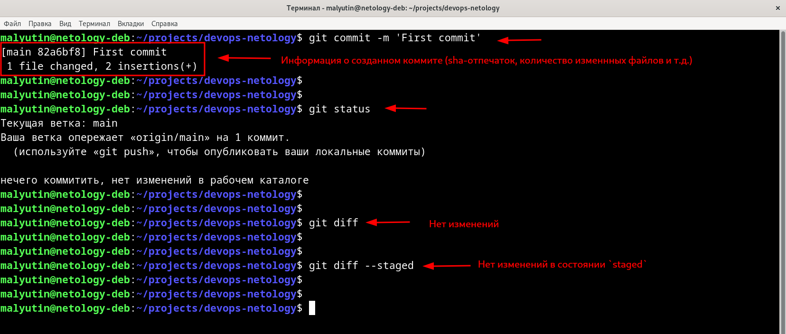

# Домашнее задание к занятию «Системы контроля версий»

## Цель задания
В результате выполнения задания я:
* научился подготоваливать новый репозиторий к работе;
* научился сохранять, перемещать и удалять файлы в системе контроля версий.

## Чеклист готовности к домашнему заданию
Установлена консольная утилита для работы с Git.

## Задание 1. Создать и настроить репозиторий для дальнейшей работы на курсе

### Создание репозитория и первого коммита
Зарегистрирован аккаунт на https://github.com/

Создан публичный репозиторий с названием `devops-netology`, который будет использоваться далее на протяжении всего курса. Репозиторий инициализирован с файлом `README.md` - установлена галочка `Initialize this repository with a README`.

Создан авторизационный токен для клонирования репозитория

Репозиторий склонирован, используя протокол HTTPS - `git clone https://github.com/vyacheslavmalyutin/devops-netology.git`

Переходим в каталог с клонированным репозиторием (`cd devops-netology`) и производим первоначальную настройку и проверку конфигурации Git:
* указываем своё имя - `git config --global user.name "Vyacheslav Malyutin"`
* указываем e-mail - `git config --global user.email "vyacheslav.malyutin@gmail.com"`
* проверяем настройки Git - `git config --list`
* проверяем статус - `git status`

Редактируем файл `README.md`, тем самым переведя файл в состояние `Modified`, и еще раз выполняем команду `git status` для контроля и проверки изменений

Просматриваем изменения в файле `README.md`, выполнив команды `git diff` и `git diff --staged`. Видим, что файл `README.md` изменен и находится в состоянии `Modified`

Переводим файл `README.md` в состояние `Staged`, выполнив команду `git add README.md`, и еще раз выполняем команды `git diff` и `git diff --staged`. Видим, что файл `README.md` изменен и находится в состоянии `Staged`

Делаем коммит с помощью команды `git commit -m 'First commit'` и еще раз выполняем команды `git diff` и `git diff --staged`. Видим, что в локальном репозитории нет больше никаких изменненных файлов в состоянии `Modified` или `Staged`.

### Создание файлов `.gitignore` и второго коммита
Создаем в корне репозитория файл `.gitignore` и проверяем его статус после создания. Добавляем файл `.gitignore` в следующий коммит командой `git add .` и проверяем статус файлов

Создаем директорию `terraform`, переходим в созданную диреткорию, создаем в ней файл `.gitignore` и наполняем файл `.gitignore` содержимым по примеру https://github.com/github/gitignore/blob/master/Terraform.gitignore

В файле `README.md` создаем описание, какие файлы будут проигнорированы в будущем благодаря добавленному `.gitignore`, проверяем изменения, добавляем новые и измененные файлы в коммит, создаем коммит с комментарием `Added gitignore` и проверяем статус, убеждаясь в том, что все новые и измененные файлы добавлены в индекс Git

### Эксперимент с удалением и перемещением файлов (третий и четвёртый коммит)
Создаем файлы `will_be_deleted.txt` с текстом `will_be_deleted` и `will_be_moved.txt` с текстом `will_be_moved`. Добавляем созданные файлы в коммит и создаем коммит с комментарием `Prepare to delete and move`.

Удаляем файл `will_be_deleted.txt`, а файл `will_be_moved.txt` переименовываем в `has_been_moved.txt`. Проверяем внесенные изменения и оформляем их коммитом с комментарием `Moved and deleted`

### Проверка изменений
Проверяем, используя комманду `git log`, какие коммиты находятся в (локальном) репозитории:
* `Initial Commit` — созданный GitHub при инициализации репозитория
* `First commit` — созданный после изменения файла `README.md`
* `Added gitignore` — после добавления `.gitignore`
* `Prepare to delete and move` — после добавления двух временных файлов (`will_be_deleted.txt` и `will_be_moved.txt`)
* `Moved and deleted` — после удаления и перемещения временных файлов

### Отправка изменений в репозиторий
Выполняем команду `git push` для отправки изменений в удаленный репозиторий на GitHub и проверяем, что все изменения, находящиеся в локальном репозитории отправлены в удаленный репозиторий на GitHub

*Для успешного выполнения команды `git push` пришлось вручную отредактировать файл `.git/config` - добавить токен, изменив значение переменной `url` секции `[remote "origin"]`.*