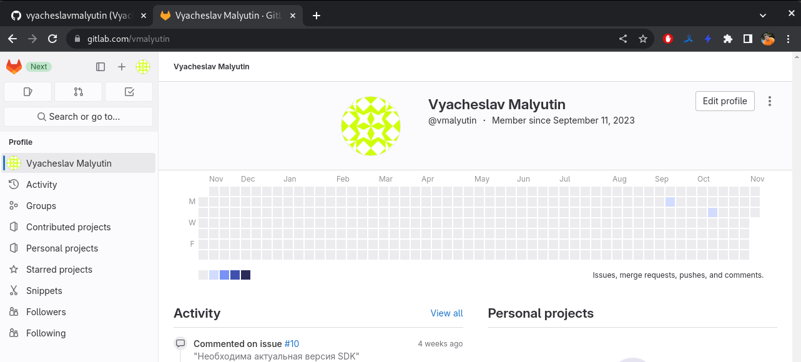
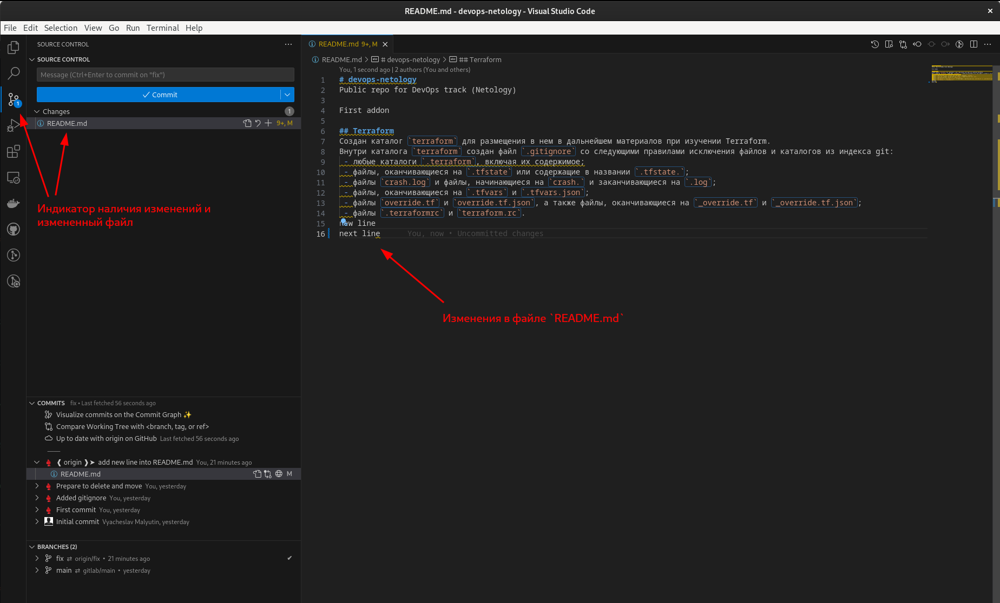

# Домашнее задание к занятию «Основы Git»

### Цель задания

В результате выполнения задания:

* научился работать с Git, как с распределённой системой контроля версий;
* научился создавать и настраивать репозиторий для работы в GitHub, GitLab;
* получил практику работы с тэгами;
* поработал с Git при помощи визуального редактора.

### Чеклист готовности к домашнему заданию

1. Установлена консольная утилита для работы с Git.

2. Зарегистрированы аккаунты на GitHub, GitLab.

------

## Задание 1. Знакомство с GitLab

Иногда при работе с Git-репозиториями надо настроить свой локальный репозиторий так, чтобы можно было отправлять и принимать изменения из нескольких удалённых репозиториев.

Это может понадобиться при работе над проектом с открытым исходным кодом, если автор проекта не даёт права на запись в основной репозиторий.

Также некоторые распределённые команды используют такой принцип работы, когда каждый разработчик имеет свой репозиторий, а в основной репозиторий пушатся только конечные результаты работы над задачами.

### GitLab

1. В GitLab создал новый проект/репозиторий `devops-netology`.  
Установлены опции:

* `visibility level` - `Public`;
* `Initialize repository with a README` - отключена.

Информация после создания проекта/репозитория

2. Добавил SSH-ключ для работы с репозиторием

3. Перешел на страницу созданного репозитория и изучил предлагаемые варианты для начала работы в репозитории в секции
`Command line instructions`.

4. В папке проекта (был создан в рамках предыдущего домашнего задания) выполнил команду `git remote -v`

5. Добавил репозиторий, созданный в GitLab, как дополнительный `remote`, к созданному репозиторию в рамках предыдущего домашнего задания:
`git remote add gitlab https://gitlab.com/vmalyutin/devops-netology.git`.

6. Отправил изменения в новый удалённый репозиторий `git push -u gitlab main` и выполнил команду просмотра удаленных репозиториев `git remote -v`

#### Как изменить видимость репозитория в  GitLab — сделать его публичным 

* На верхней панели выберал «Меню» -> «Проекты» и нашел свой проект.
* На левой боковой панели выбрал «Настройки» -> «Основные».
* Развернул раздел «Видимость» -> «Функции проекта» -> «Разрешения».

------

## Задание 2. Теги

*Представьте ситуацию, когда в коде была обнаружена ошибка — надо вернуться на предыдущую версию кода, исправить её и выложить исправленный код в продакшн. Мы никуда не будем выкладывать код, но пометим некоторые коммиты тегами и создадим от них ветки.*

1. Создал легковестный тег `v0.0` (`git tag v0.0`) на HEAD-коммите и запушил его во все добавленные на предыдущем этапе `upstream` (`git push origin v0.0 && git push gitlab v0.0`).

2. Создайл аннотированный тег `v0.1` (`git tag -a v0.1 -m "annotated tag"`) и запушил его во все добавленные на предыдущем этапе `upstream` (`git push origin v0.1 && git push gitlab v0.1`).

3. Перешел на страницу просмотра тегов в GitHab и GitLab и увидел, чем отличаются созданные теги - аннотированный тэг содержит имя
автора, его email и дату создания, имеют комментарий.

   * в GitHub — `https://github.com/vyacheslavmalyutin/devops-netology/tags`

   * в GitLab — `https://gitlab.com/vmalyutin/devops-netology/-/tags`

------

## Задание 3. Ветки

*Посмотрим, как будет выглядеть история коммитов при создании веток.*

1. Переключился на ветку `main`, которая связана с веткой `main` репозитория на `github`.

2. Вывел лог коммитов (`git log --oneline`), нашел хеш коммита с названием `Prepare to delete and move`, который был создан в пределах предыдущего домашнего задания, и переключил HEAD на него (`git checkout f8a0728`).

3. Создал новую ветку `fix`, базируясь на этом коммите (`git switch -c fix`), и отправил новую ветку в удаленный репозиторий GitHub (`git push -u origin fix`).

4. Посмотрл, как визуально выглядит получившаяся схема коммитов: `https://github.com/vyacheslavmalyutin/devops-netology/network`.

5. Изменил содержание файла `README.md`, добавив новую строчку (`echo "new line" >> README.md`), сделал коммит (`git commit -a -m "add new line into README.md"`) и отправил изменения в репоизиторий (`git push`).

6. Изменилась схема коммитов на странице `https://github.com/vyacheslavmalyutin/devops-netology/network`

7. Вывод команды `git log`

------

## Задание 4. Упрощаем себе жизнь

Работаем с Git при помощи визуального редактора.

1. В используемой IDE VSCode открыл визуальный редактор работы с Git, находящийся в меню `View -> Source Control`.

2. Изменил файл `README.md` - добавил строку с текстом `next line`. Измененный файл появился на вкладке `Source Control`.

3. Добавил комментарий к коммиту и выполнил коммит, нажав на кнопку `Commit`. Изменил еще раз файл `README.md` - добавил строку с текстом `another line`. Измененный файл появился на вкладке `Source Control`. Добавил комментарий к коммиту и выполнил коммит, нажав на кнопку `Commit`.

4. Отправил коммиты в удаленный репозиторий, нажав кнопку `Sync Changes`.

5. Так выглядит визуализация дерева коммитов/веток в IDE VSCode

