# Домашнее задание к занятию «Ветвления в Git»

## Цель задания

В процессе работы над заданием потренироваться и отработать навыки делать **merge** и **rebase**. В результате выполнения задания необходимо понять разницу между **merge** и **rebase** и научиться решать конфликты.

Обычно при нормальном ходе разработки выполнять **rebase** достаточно просто.  
**Rebase** позволяет объединить множество промежуточных коммитов при решении задачи, чтобы не засорять историю.

------

## Задание «Ветвление, merge и rebase»  

*Предположим, что есть задача — написать скрипт, выводящий на экран параметры его запуска.*
*Давайте посмотрим, как будет отличаться работа над этим скриптом с использованием ветвления, **merge** и **rebase**.*

**Шаг 1.** Создаем в своём репозитории каталог `branching` и в нём два файла — `merge.sh` и `rebase.sh` — со следующим содержимым:

```bash
#!/bin/bash
# display command line options

count=1
for param in "$*"; do
    echo "\$* Parameter #$count = $param"
    count=$(( $count + 1 ))
done
```

*Скрипт отображает на экране все параметры одной строкой, а не разделяет их.*

Результат выполнения действий на шаге 1.
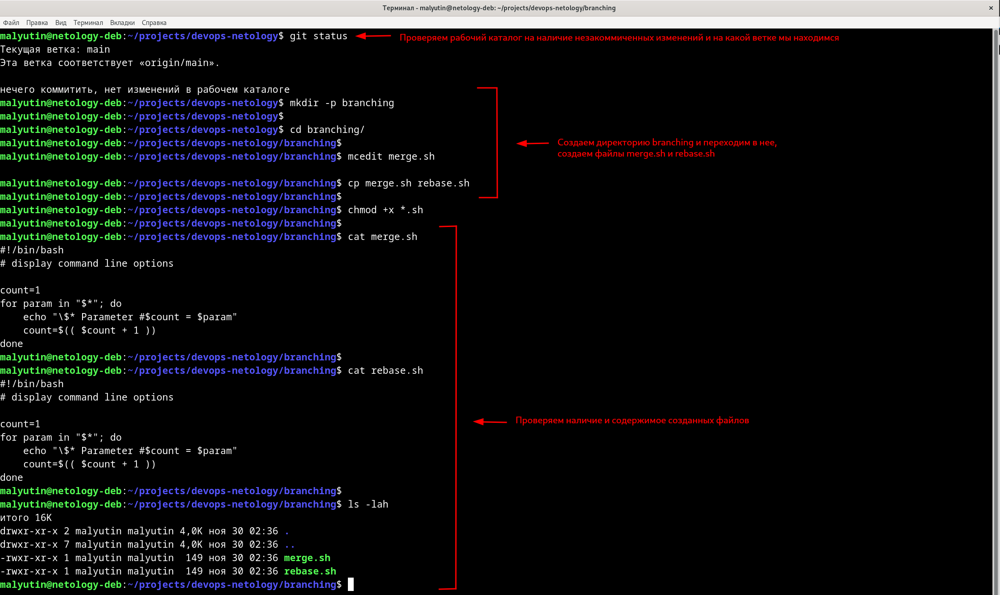

**Шаг 2.** Создаем коммит с описанием `prepare for merge and rebase` и отправляем его в ветку main.

Результат выполнения действий на шаге 2.
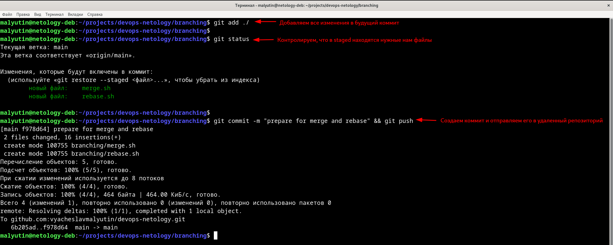

------

### Подготовка файла `merge.sh`

**Шаг 1.** Создаем ветку `git-merge` от ветки `main`.

**Шаг 2.** Меняем содержимое файла `merge.sh` на следующее:

```bash
#!/bin/bash
# display command line options

count=1
for param in "$@"; do
    echo "\$@ Parameter #$count = $param"
    count=$(( $count + 1 ))
done
```

**Шаг 3.** Создаем коммит `merge: @ instead *` и отправляем изменения в репозиторий.

Результат выполнения действий на шагах 1-3.
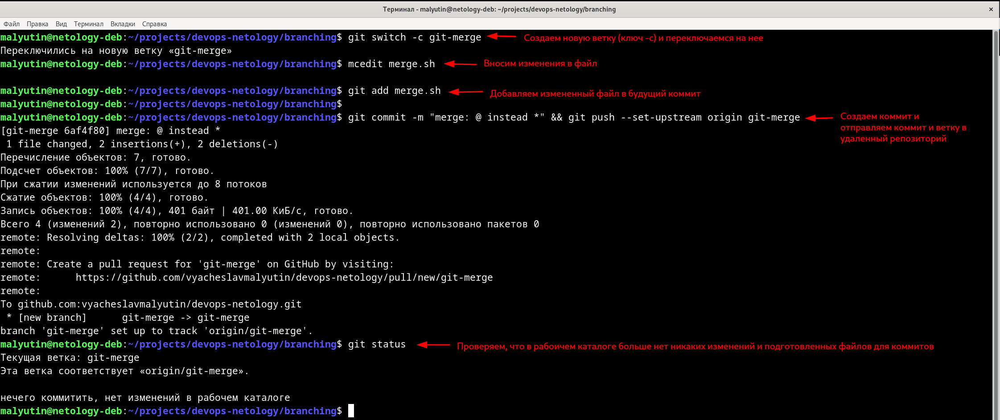

В репозитории находятся изменения, сделанные на Шаге 2 - только две строки.

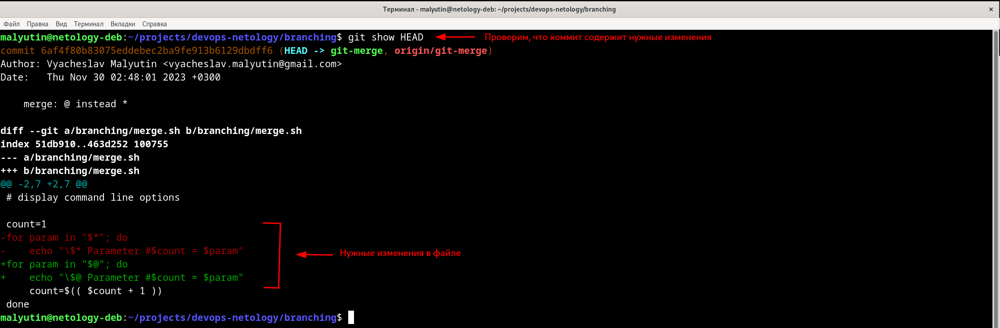

**Шаг 4.** Вносим ещё одно изменение в `merge.sh`:

```bash
#!/bin/bash
# display command line options

count=1
while [[ -n "$1" ]]; do
    echo "Parameter #$count = $1"
    count=$(( $count + 1 ))
    shift
done
```

*Теперь скрипт будет отображать каждый переданный ему параметр отдельно.*

**Шаг 5.** Создаем коммит `merge: use shift` и отправляем изменения в репозиторий.

Результат выполнения действий на шагах 4-5.
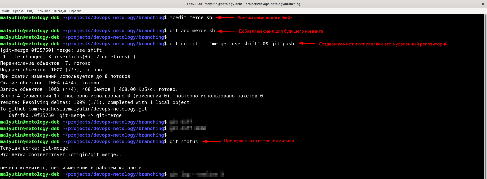

------

### Изменим main  

**Шаг 1.** Переключаемся в ветку `main`.  
**Шаг 2.** Предположим, что пока мы работали над веткой `git-merge`, кто-то изменил `main`.  
Для этого изменим содержимое файла `rebase.sh` на:

```bash
#!/bin/bash
# display command line options

count=1
for param in "$@"; do
    echo "\$@ Parameter #$count = $param"
    count=$(( $count + 1 ))
done

echo "====="
```

*В этом случае скрипт тоже будет отображать каждый параметр в новой строке.*

**Шаг 3.** Отправляем изменённую ветку `main` в репозиторий.

Результат выполнения действий на шагах 1-3.
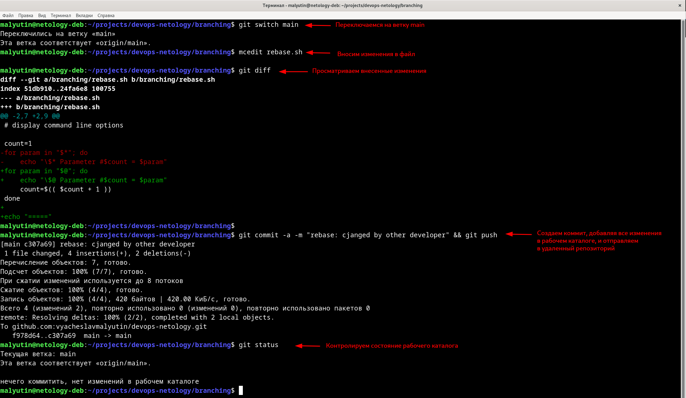

------

#### Подготовка файла rebase.sh  

**Шаг 1.** Предположим, что теперь другой участник нашей команды не сделал `git pull` либо просто хотел ответвиться не от последнего коммита в `main`, а от коммита, когда мы только создали два файла `merge.sh` и `rebase.sh` на первом шаге.  
При помощи команды `git log` найдём хеш коммита `prepare for merge and rebase` и переключимся на него (`git checkout f978d64`, где `f978d64` - хэш коммита `prepare for merge and rebase`)
**Шаг 2.** Создадим ветку `git-rebase`, основываясь на текущем коммите.
**Шаг 3.** Изменим содержимое файла `rebase.sh` на следующее, тоже починив скрипт, но немного в другом стиле:

```bash
#!/bin/bash
# display command line options

count=1
for param in "$@"; do
    echo "Parameter: $param"
    count=$(( $count + 1 ))
done

echo "====="
```

Результат выполнения действий на шагах 1-3.
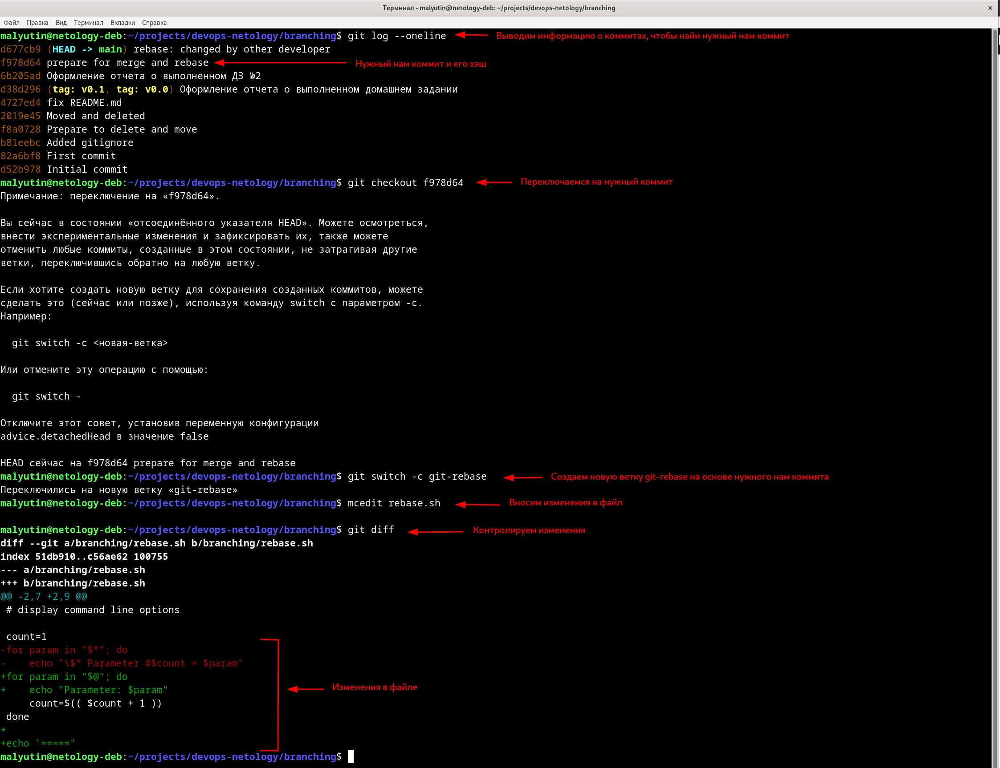

**Шаг 4.** Отправим эти изменения в ветку `git-rebase` с комментарием `git-rebase 1`.

Результат выполнения действий на шаге 4.
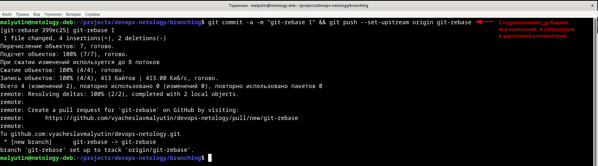

**Шаг 5.** Сделаем ещё один коммит `git-rebase 2` с пушем, заменив `echo "Parameter: $param"` на `echo "Next parameter: $param"`.

Результат выполнения действий на шаге 5.
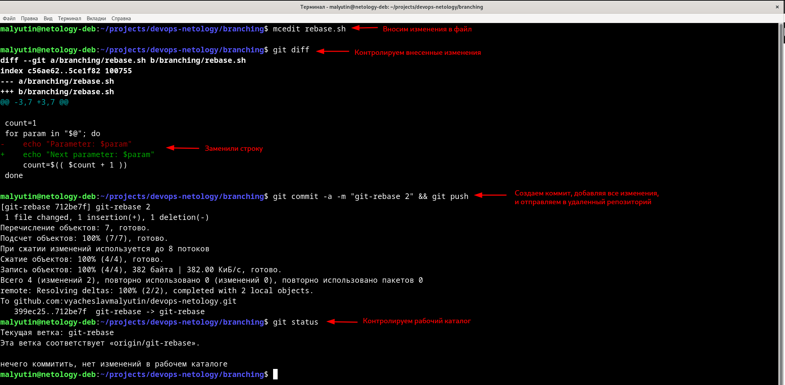

------

### Промежуточный итог  

Сэмулировали типичную ситуации в разработке кода, когда команда разработчиков работала над одним и тем же участком кода, и кто-то из разработчиков предпочитает делать `merge`, а кто-то — `rebase`. Конфликты с merge обычно решаются просто, а с rebase бывают сложности, поэтому смержим все наработки в `main` и разрешим конфликты.

На странице `Network` в GitHub, находящейся по адресу <https://github.com/vyacheslavmalyutin/devops-netology/network>, вот такое графическое представление веток в репозитории:

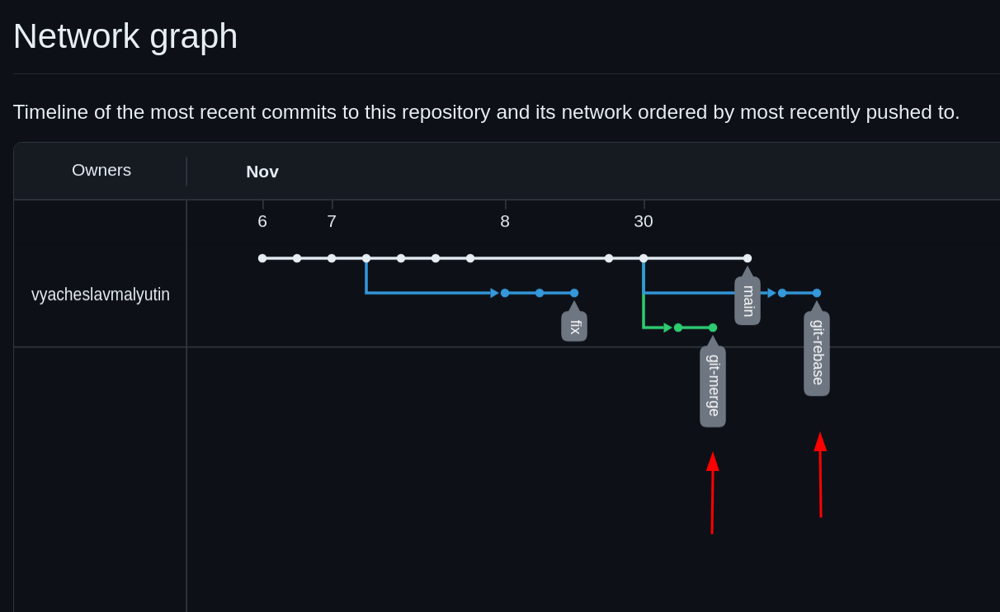

------

### Merge

Мержим ветку `git-merge` в `main` и отправляем изменения в репозиторий

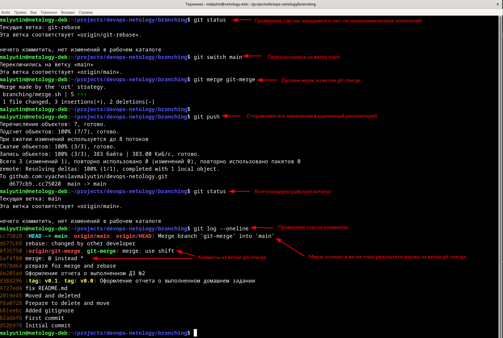

В результате получаем такую схему на странице `Network` в GitHub <https://github.com/vyacheslavmalyutin/devops-netology/network>, где видно слияние ветки `git-merge` в ветку `main`:
  
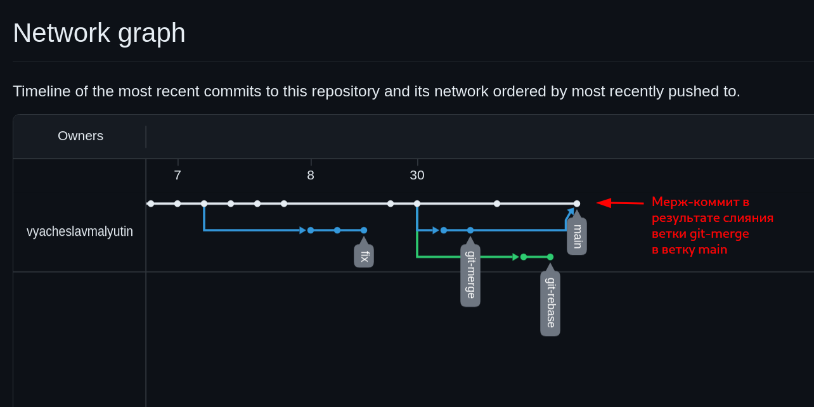

------

### Rebase

**Шаг 1.** Перед мержем ветки `git-rebase` выполняем её `rebase` на `main`, намеренно создавая ситуацию с конфликтами, чтобы их разрешить.
**Шаг 2.** Переключаемся на ветку `git-rebase` и выполняем `git rebase -i main`.

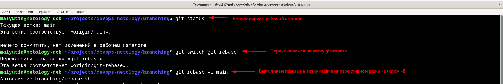

В открывшемся диалоге указаны два выполненных коммита, которые объединим в один, используя метод `fixup`.

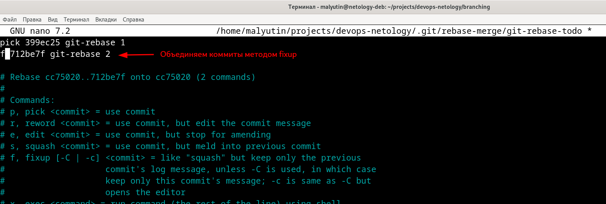

Сохраняем файл в диалоговм окне и получаем результат - имеется конфликт в файле `branching/rebase.sh`. Просматриваем содержимое файла `branching/rebase.sh` и видим метки, оставленные git для решения конфликта.

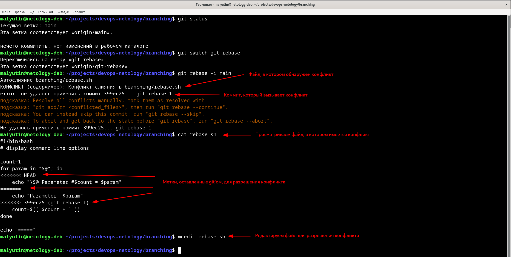

Редактируем файл `branching/rebase.sh`, удалив метки, отдав предпочтение варианту кода из ветки `main`.

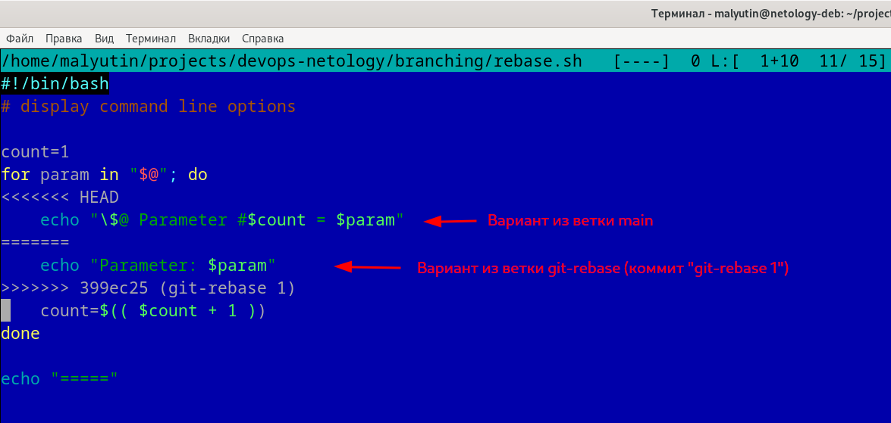

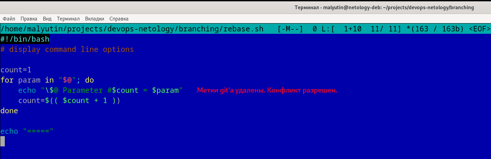

**Шаг 4.** Сохраняем файл и сообщим Git, что конфликт решён, добавляя измененный файл в индекс командой `git add rebase.sh`, и продолжим rebase командой `git rebase --continue`.

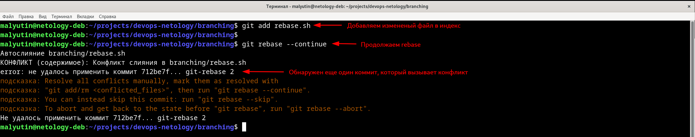

**Шаг 5.** Получили конфликт в файле `rebase.sh` при попытке применения второго коммита `git-rebase 2`. Разрешаем конфликт, оставив строчку `echo "Next parameter: $param"`.

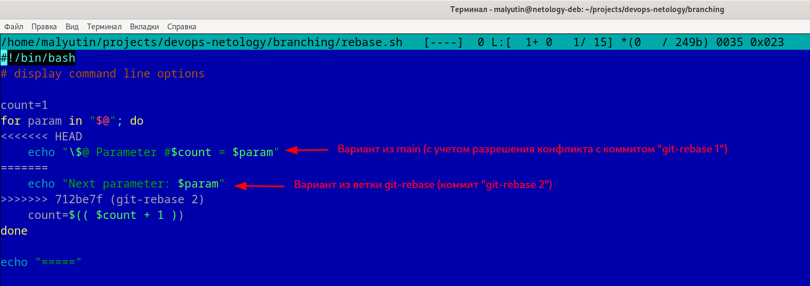

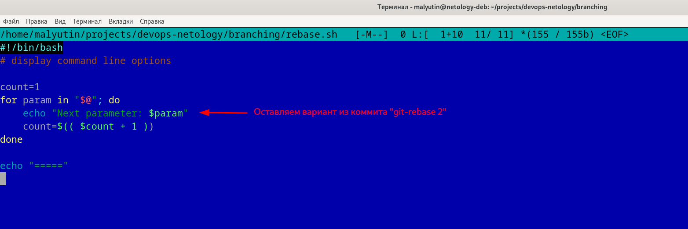

**Шаг 6.** Сохраняем файл и сообщим Git о том, что конфликт разрешён, добавив измененный файл в индекс командой `git add rebase.sh` — и продолжим rebase командой `git rebase --continue`.

В результате будет открыт текстовый редактор, предлагающий написать комментарий к новому объединённому коммиту:

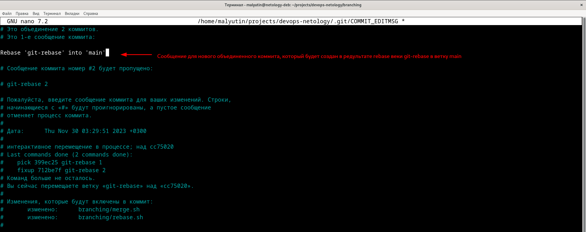

*Все строчки, начинающиеся на `#`, будут проигнорированны.*

После сохранения изменения Git сообщил, что rebase успешно завершен, но при этом HEAD находится в состоянии detached.

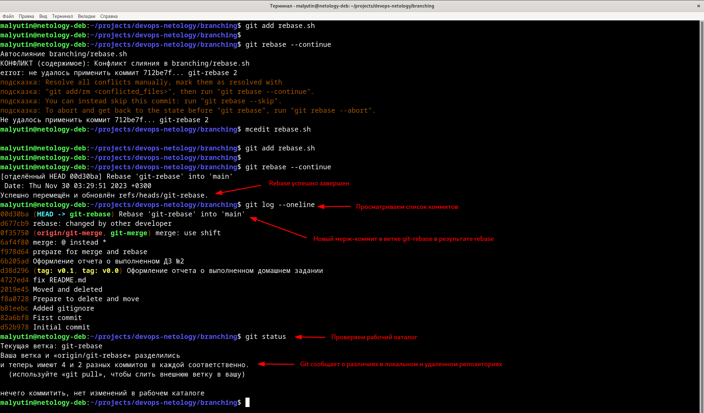

**Шаг 7.** При выполнении команды `git push` (или `git push -u origin git-rebase`, чтобы точно указать, что и куда мы хотим запушить), будет ошибка. Это произошло, потому что мы попытались перезаписать историю уже существующих коммитов в удаленном репозитории.

**Шаг 8.** Для принудительной отправки изменений необходимо воспользоваться флагом `--force`. Git успешно перезапишет всю историю и коммиты в удаленном репозитории.

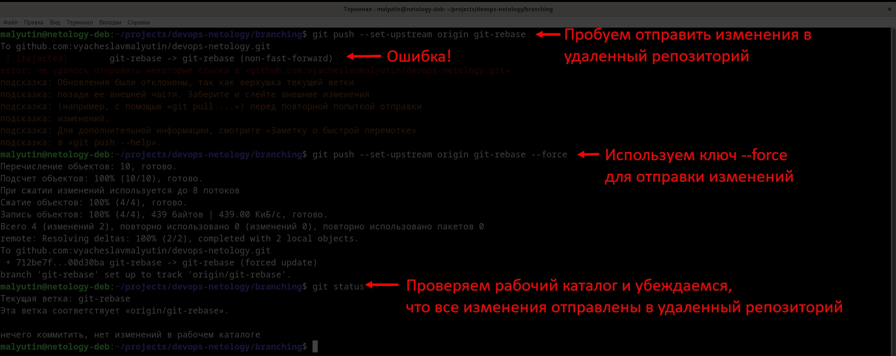

*На этом этапе виртуалка глюкнула, и пришлось делать скриншот из хостовой системы, чтобы продемонстрировать все выполненные действия, не откатываясь к началу ДЗ, т.к. пришлось-бы переделать все скриншоты из-за изменившихся хэшей новых коммитов. Поэтому он получился такого качества.*

**Шаг 9**. Выполняем мерж ветки `git-rebase` в `main` без конфликтов, но получаем дополнительный мерж-коммит.

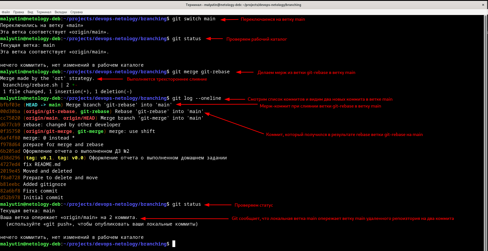

Чтобы выполнить мерж ветки `git-rebase` в `main` без конфликтов, и без дополнительного мерж-коммита методом `fast-forward` (простое перемещение указателя HEAD) необходимо было перед мержем сделать еще раз `rebase` на `main` (для примера использовал ветки с суффиксами `-ff`).

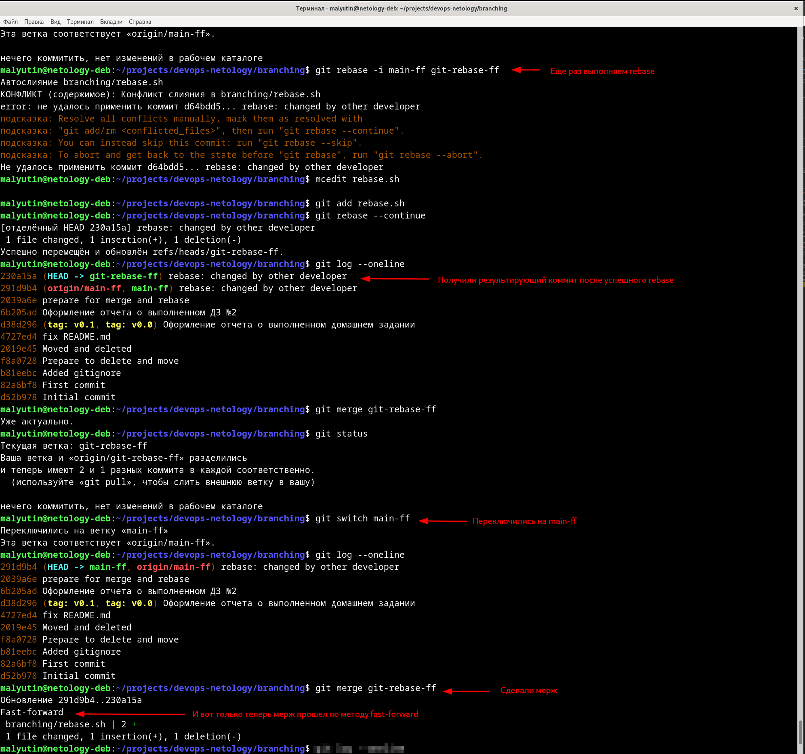

И получаем на странице `Network` в GitHub, находящейся по адресу <https://github.com/vyacheslavmalyutin/devops-netology/network>, вот такое графическое представление веток в репозитории:

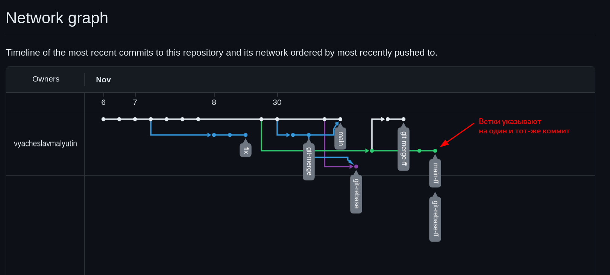
