# Домашнее задание к занятию «Kubernetes. Причины появления. Команда kubectl»

## Цель задания

Для экспериментов и валидации решений нужно подготовить тестовую среду для работы с Kubernetes. Оптимальное решение — развернуть на рабочей машине или на отдельной виртуальной машине MicroK8S.

------

## Чеклист готовности к домашнему заданию

ВМ c ОС Linux на локальной машине для установки MicroK8S

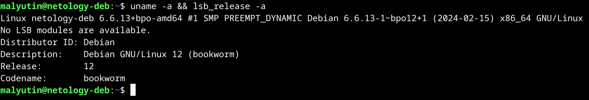

------

## Задание 1. Установка MicroK8S

1. Установка MicroK8S (`snapd` уже был установлен ранее) на локальную виртуальную машину выполнена с помощью команды.

```bash
sudo snap install microk8s --classic
```

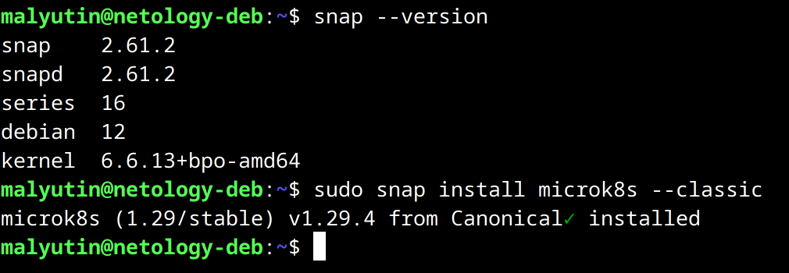

Добавляем пользователя в группу `microk8s`, изменяем права на папку с конфигурацией и обновляем список групп для текущего пользователя

```bash
sudo usermod -aG microk8s $USER
sudo chown -f -R $USER ~/.kube
newgrp microk8s
```

Проверяем установленную версию `microk8s`

```bash
microk8s version
```

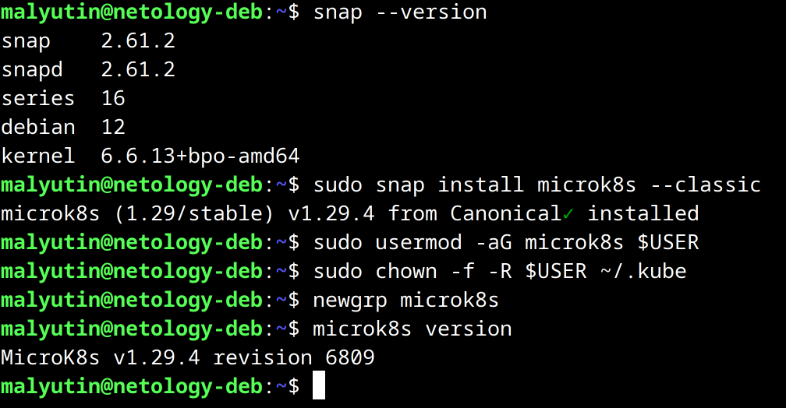

Проверяем статус

```bash
microk8s status --wait-ready
```

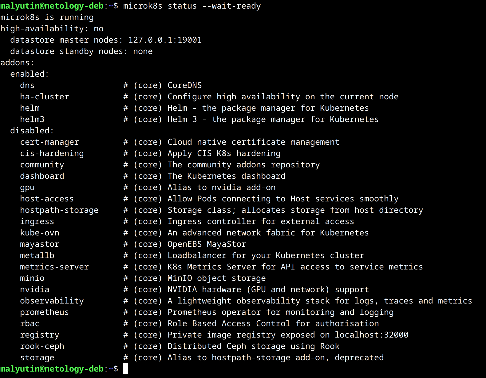

Получаем информацио о нодах

```bash
microk8s kubectl get nodes
```

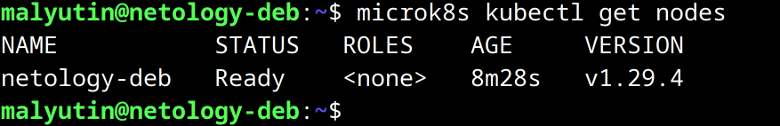

Получаем информацию о сервисах

```bash
microk8s kubectl get services
```

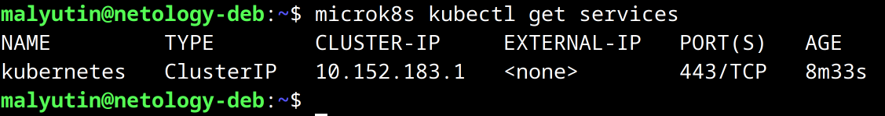

2. Установка `Dashboard`.

Ссылка на документацию по установке `Dashboard`: <https://microk8s.io/docs/addon-dashboard>

Установка `Dashboard` выполняется с помощью команды

```bash
microk8s enable dashboard
```

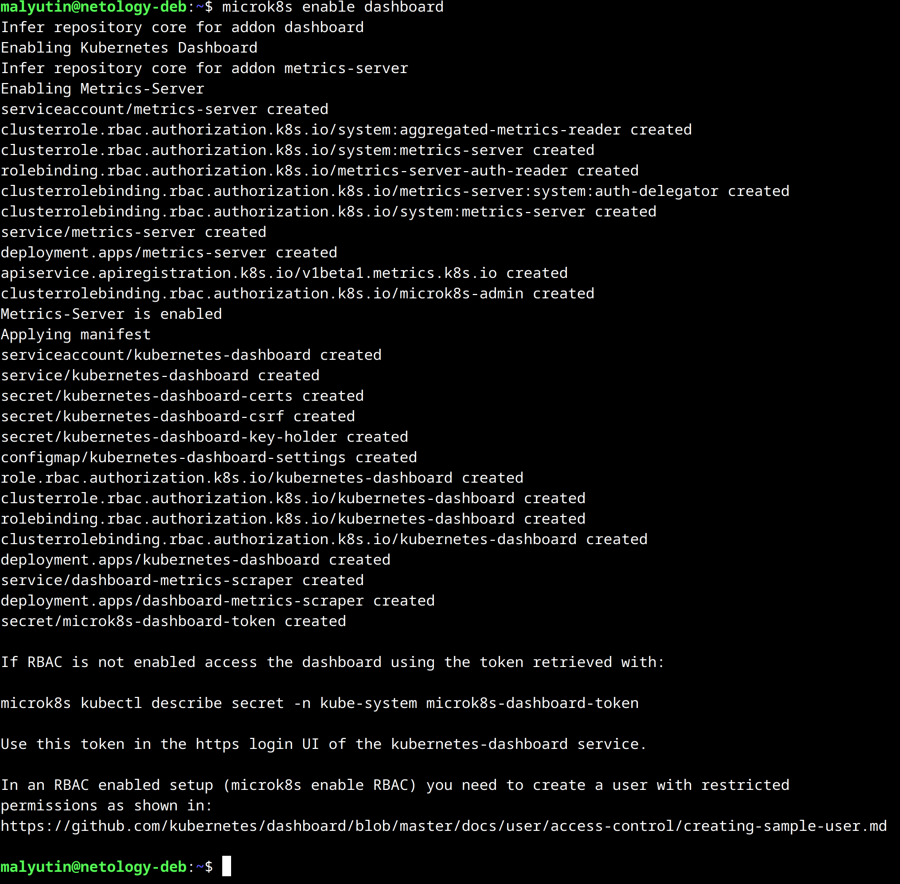

Для подключения к `Dashboard` необходимо сгенерировать токен

```bash
microk8s kubectl create token default
```

Делаем `port-forward` для подключения к `Dashboard`

```bash
microk8s kubectl port-forward -n kube-system service/kubernetes-dashboard 10443:443
```

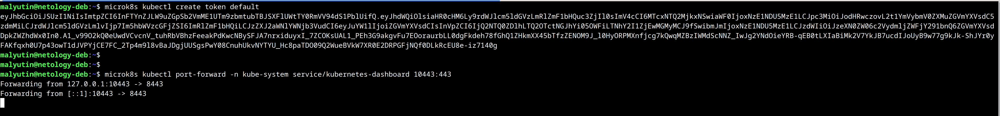

И подключаемся к `Dashboard` по адресу https://127.0.0.1:10443 с ранее сгенерированным токеном

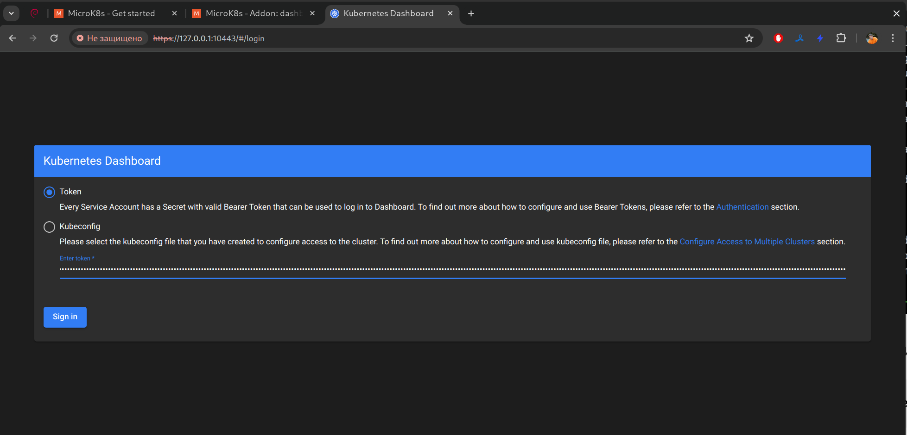

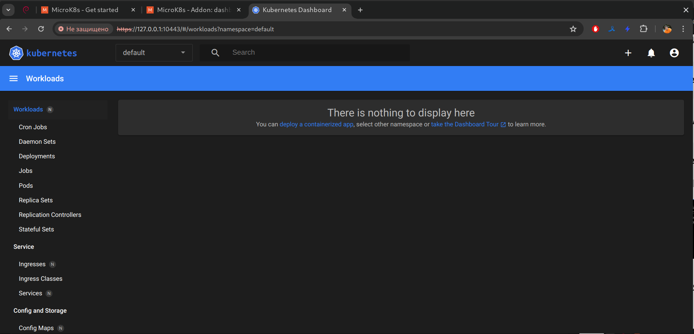

3. Сгенерировать сертификат для подключения к внешнему IP-адресу.

Редактируем файл `/var/snap/microk8s/current/certs/csr.conf.template` - добавляем в него IP-адрес для внешнего подключения (в данном случае IP-адрес сетевого интерфейса виртуальной машины)

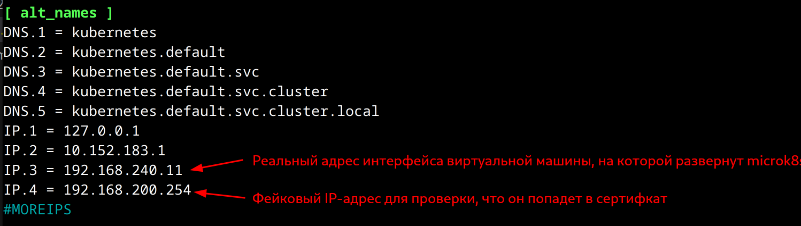

Обновляем сертификаты командой

```bash
sudo /snap/bin/microk8s refresh-certs --cert front-proxy-client.crt
```

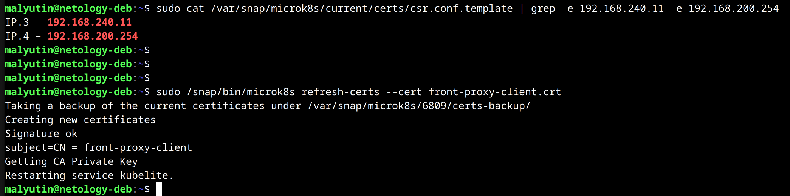

Проверяем сертифкат на наличие в нем добавленных IP-адресов

```bash
sudo openssl x509 -in /var/snap/microk8s/current/certs/front-proxy-client.crt -text -noout | grep -e 192.168.240.11 -e 192.168.200.254
```

Оба адреса присутствут в обновленном сертифкате

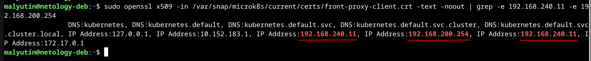

*Адрес `192.168.240.11` в сертификате содержится дважды, потому что один раз он добавляется из конфигурационного файла, а второй - как адрес локального сетевого интерфейса виртуальной машины, на которой развернут `microk8s`.*

------

## Задание 2. Установка и настройка локального kubectl

> *У меня хостовая машина под Windows, поэтому установка производится на соседнюю виртуальную машину с Linux.*

1. Устанавливаем `kubectl`.

```bash
curl -LO https://storage.googleapis.com/kubernetes-release/release/`curl -s https://storage.googleapis.com/kubernetes-release/release/stable.txt`/bin/linux/amd64/kubectl
```

Задаем необходимые разрешения и помещаем исполняемый файл в директорию, которая находится в `$PATH`

```bash
chmod +x ./kubectl
sudo mv ./kubectl /usr/local/bin/kubectl
```

Результат

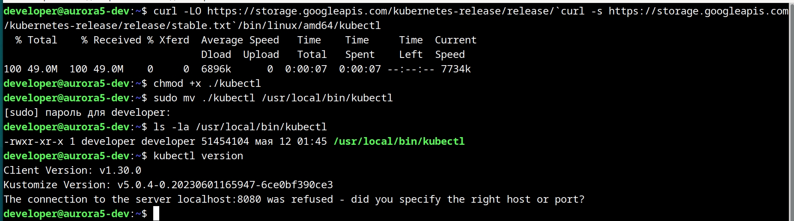

2. Настроить локально подключение к кластеру.

Сначала импортируем конфигурационный файл кластера с ВМ, на которой развернут `microk8s`, с помощью команды

```bash
microk8s config > ~/.kube/microk8s-lab
```

Копируем конфигурационный файл на ВМ с установленным `kubectl` и проверяем подключение к кластеру `microk8s` командой, предварительно через переменную окружения указав, какой конйигурационный файл необходимо использовать для подключения к кластеру (`export KUBECONFIG=~/.kube/microk8s-lab`)

```bash
kubectl get nodes
```

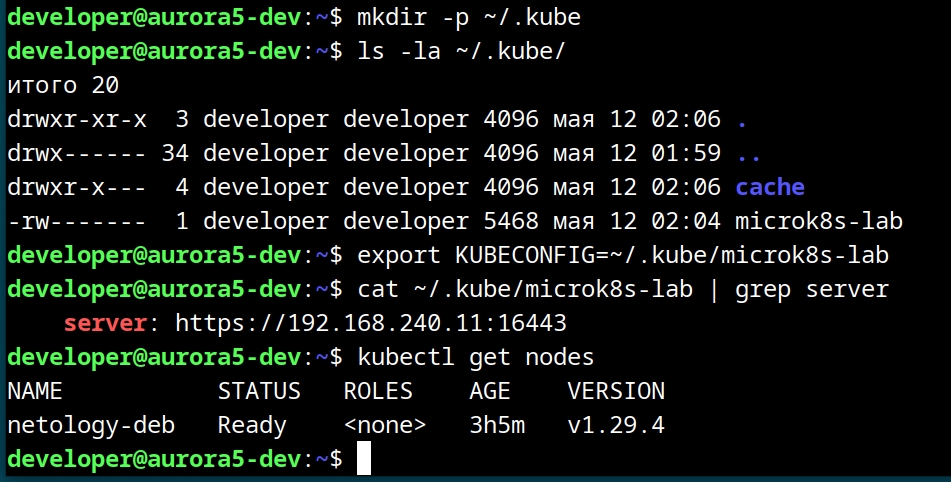

3. Подключиться к `Dashboard` с помощью `port-forward`.

Включаем `port-forward` на локальную ВМ с установленным `kubectl`

```bash
kubectl port-forward -n kube-system service/kubernetes-dashboard 18555:443
```

И подключаемся к `Dashboard` кластера, указывая IP-адрес localhost и порт, на который форвардим сервис `Dashboard` кластера

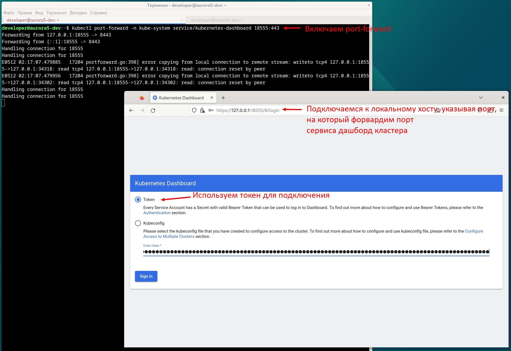

Авторизуемся по токену и попадаем в панель `Dashboard`

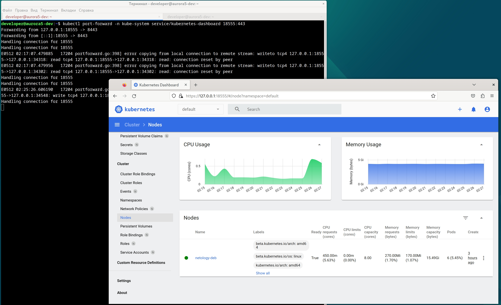

------
