# Домашнее задание к занятию «Базовые объекты K8S»

## Цель задания

В тестовой среде для работы с Kubernetes, установленной в предыдущем ДЗ, необходимо развернуть Pod с приложением и подключиться к нему со своего локального компьютера. 

------

## Чеклист готовности к домашнему заданию

1. Установленное k8s-решение (MicroK8S).

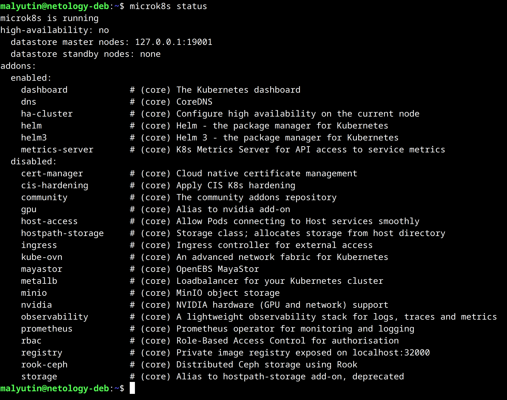

2. Установленный локальный kubectl.

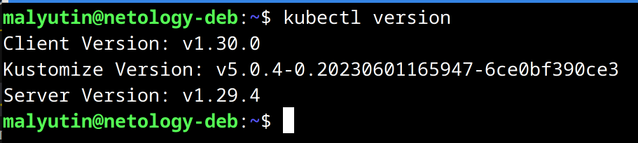

3. Редактор YAML-файлов с подключенным Git-репозиторием.

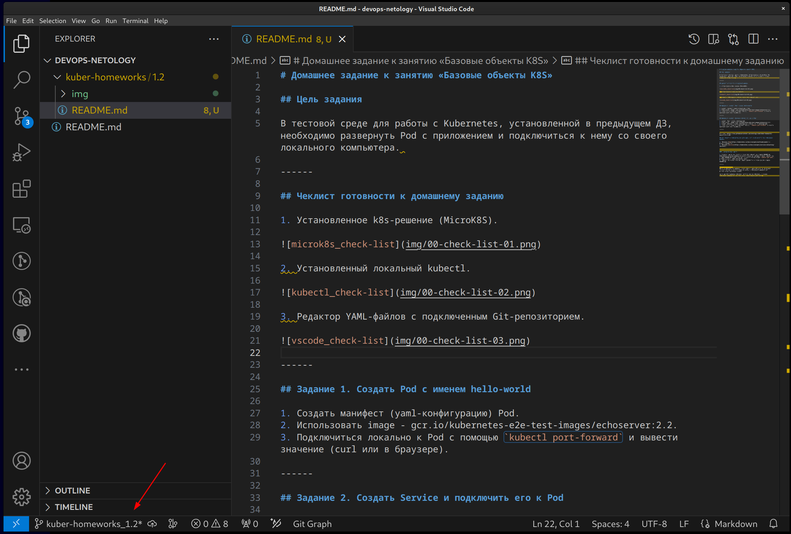

------

## Задание 1. Создать Pod с именем hello-world

1. Создал конфигурацию (манифест) для Pod'а с именем `hello-world` - [pod-hello-world.yaml](./pod-hello-world.yaml)

```yaml
apiVersion: v1
kind: Pod
metadata:
  name: hello-world
  namespace: default
  labels:
    app: pod-lab
spec:
  containers:
  - name: echoserver
    image: gcr.io/kubernetes-e2e-test-images/echoserver:2.2
    imagePullPolicy: IfNotPresent
    ports:
    - containerPort: 8080
    - containerPort: 8443
```

Применил конфигурацию с помощью команды

```bash
kubectl apply -f ./pod-echoserver.yaml
```

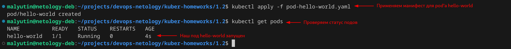

2. Использовал image - `gcr.io/kubernetes-e2e-test-images/echoserver:2.2`.

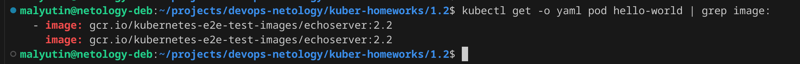

3. Включил `port-forward` из созданного pod'а `hello-world` на локальный хост с помощью команды

```bash
kubectl port-forward pod/hello-world 20001:8080
```

Выполнил запрос (с помощью `curl`) к pod'у

```bash
curl http://127.0.0.1:20001
```

Результат выполнения запроса

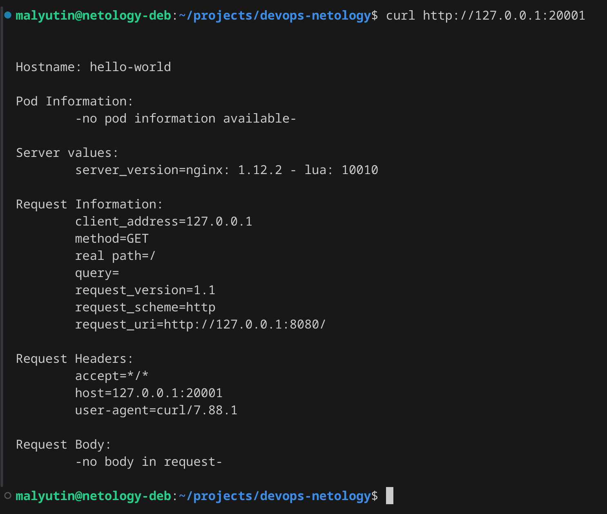

------

## Задание 2. Создать Service и подключить его к Pod

1. Создал конфигурацию для Pod'а с именем `netology-web` - [pod-netology-web.yaml](./pod-netology-web.yaml)

```yaml
apiVersion: v1
kind: Pod
metadata:
  name: netology-web
  namespace: default
  labels:
    app: pod-netology
spec:
  containers:
  - name: echoserver
    image: gcr.io/kubernetes-e2e-test-images/echoserver:2.2
    imagePullPolicy: IfNotPresent
    ports:
    - containerPort: 8080
    - containerPort: 8443
```

Применил конфигурацию с помощью команды

```bash
kubectl apply -f ./pod-netology-web.yaml
```

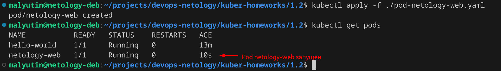

2. Использовал image - `gcr.io/kubernetes-e2e-test-images/echoserver:2.2`.

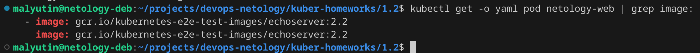

3. Создал Service с именем `netology-svc` - [service-netology-svc.yaml](./service-netology-svc.yaml)

```yaml
apiVersion: v1
kind: Service
metadata:
  name: netology-svc
spec:
  selector:
    app: pod-netology
  ports:
  - name: http
    port: 80
    protocol: TCP
    targetPort: 8080
  - name: https
    port: 8443
    protocol: TCP
    targetPort: 8443
```

Применил конфигурацию с помощью команды

```bash
kubectl apply -f ./service-netology-svc.yaml
```

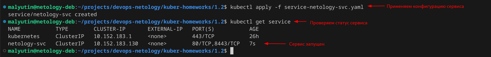

Проверяем, что в Endpoints сервиса `netology-svc` указан Pod `netology-web`.

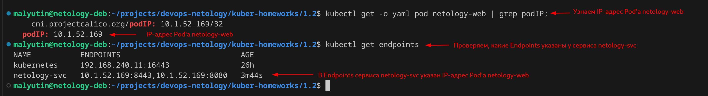

4. Подключиться локально к Service `netology-svc` с помощью `kubectl port-forward` с помощью команды

```bash
kubectl port-forward services/netology-svc 30001:80
```

Выполнил запрос (с помощью `curl`) к pod'у

```bash
curl http://127.0.0.1:30001
```

Результат выполнения запроса

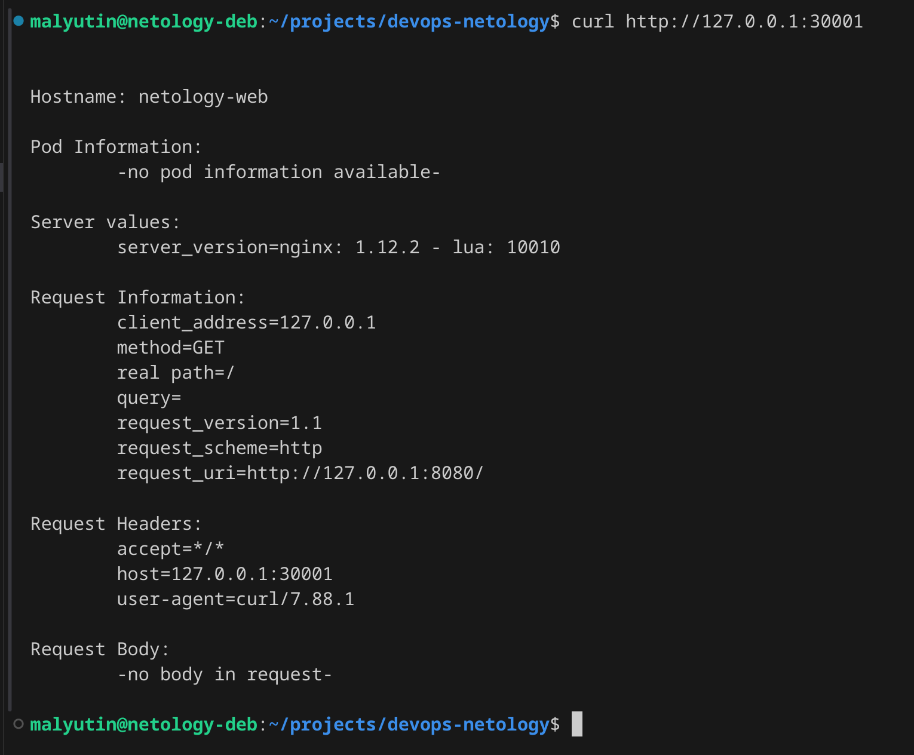
