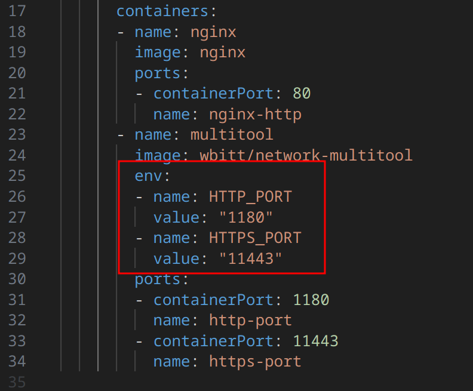
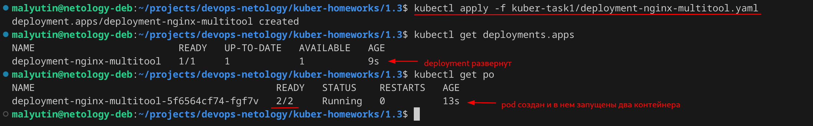
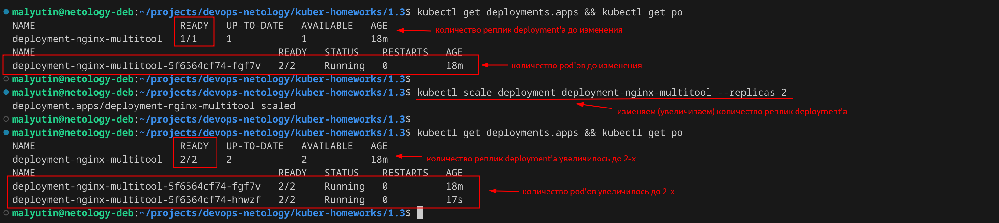
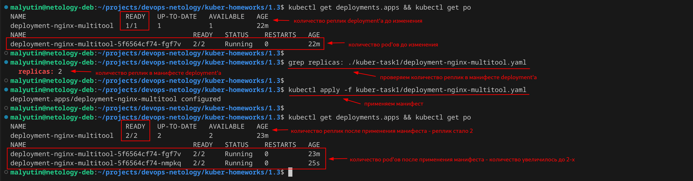
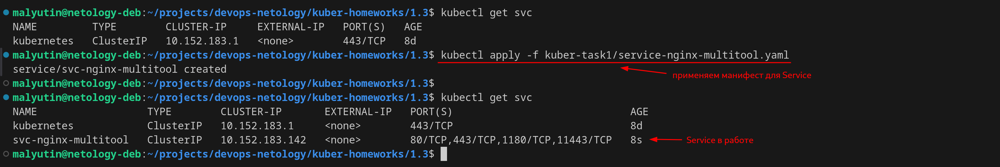
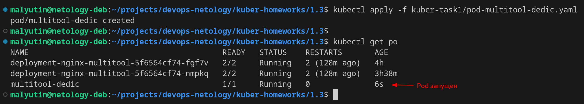
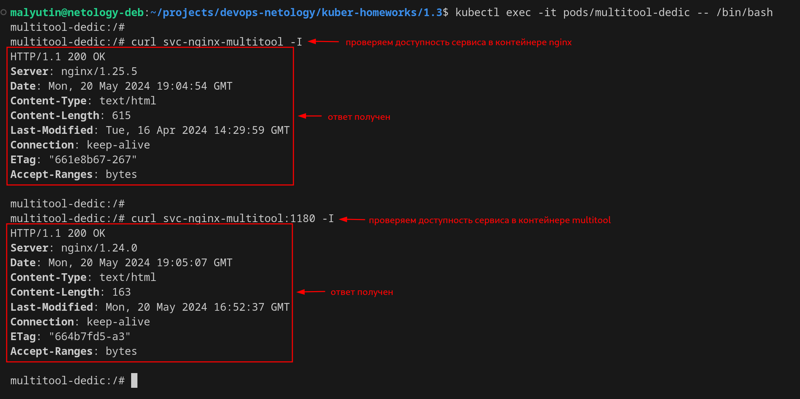
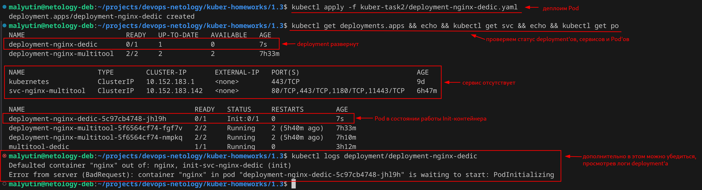
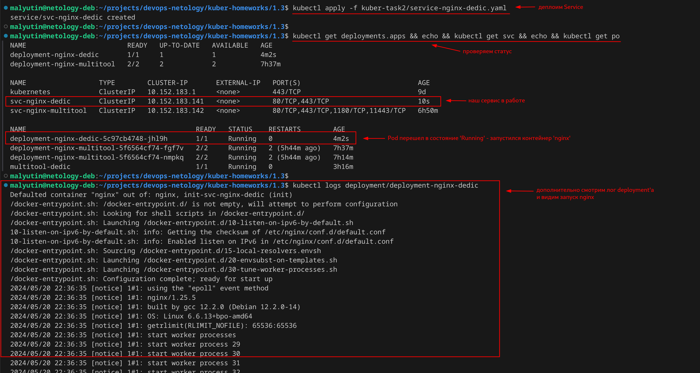

# Домашнее задание к занятию «Запуск приложений в K8S»

## Цель задания

В тестовой среде для работы с Kubernetes, установленной в предыдущем ДЗ, необходимо развернуть Deployment с приложением, состоящим из нескольких контейнеров, и масштабировать его.

------

### Чеклист готовности к домашнему заданию

1. Установленное k8s-решение (например, MicroK8S).

2. Установленный локальный kubectl.

3. Редактор YAML-файлов с подключённым git-репозиторием.

Все необходимые требования соблюдены


------

### Задание 1. Создать Deployment и обеспечить доступ к репликам приложения из другого Pod

1. Создать Deployment приложения, состоящего из двух контейнеров — `nginx` и `multitool`. Решить возникшую ошибку.

Создал манифест для deployment'а - [deployment-nginx-multitool.yaml](./kuber-task1/deployment-nginx-multitool.yaml)

```yaml
apiVersion: apps/v1
kind: Deployment
metadata:
  name: deployment-nginx-multitool
  labels:
    app: nginx
spec:
  replicas: 1
  selector:
    matchLabels:
      app: nginx
  template:
    metadata:
      labels:
        app: nginx
    spec:
      containers:
      - name: nginx
        image: nginx
        ports:
        - containerPort: 80
          name: http-nginx
        - containerPort: 443
          name: https-nginx
      - name: multitool
        image: wbitt/network-multitool
        env:
        - name: HTTP_PORT
          value: "1180"
        - name: HTTPS_PORT
          value: "11443"
        ports:
        - containerPort: 1180
          name: http-multitool
        - containerPort: 11443
          name: https-multitool
```

Ошибка (вероятная, если не прочитать документацию) может быть по причине использования по-умолчанию одинаковых портов (80 и 443) контейнерами `nginx` и `multitool`. Решается с помощью передачи через переменные окружения параметров портов, на которых запускается `nginx` в контейнере `multitool`.



Запуск deployment'а выполнен с помощью команды

```bash
kubectl apply -f ./kuber-task1/deployment-nginx-multitool.yaml
```

Результат представлен на скриншоте.



2-3. После запуска увеличить количество реплик работающего приложения до 2. Продемонстрировать количество подов до и после масштабирования.

Количество реплик можно увеличить следующими способами:

- прямой командой `kubectl scale`;
- изменив параметр `.spec.replicas` в манифесте deployment'а и применив его повторно (IaaC-way).

**Вариант 1. Изменение количества реплик приложения с помощью команды `kubectl scale`.**

```bash
kubectl scale deployment deployment-nginx-multitool --replicas 2
```

Результат



**Вариант 2. Изменение количества реплик приложения через правку манифеста и его повторное применение.**

```bash
kubectl apply -f kuber-task1/deployment-nginx-multitool.yaml
```

Результат



4. Создать Service, который обеспечивает доступ до реплик приложений из п.1.

Создал манифест для Service - [service-nginx-multitool.yaml](./kuber-task1/service-nginx-multitool.yaml)

```yaml
apiVersion: v1
kind: Service
metadata:
  name: svc-nginx-multitool
spec:
  selector:
    app: nginx
  ports:
  - name: http-nginx
    port: 80
    protocol: TCP
    targetPort: 80
  - name: https-nginx
    port: 443
    protocol: TCP
    targetPort: 443
  - name: http-multitool
    port: 1180
    protocol: TCP
    targetPort: 1180
  - name: https-multitool
    port: 11443
    protocol: TCP
    targetPort: 11443
```

И применил его командой

```bash
kubectl apply -f kuber-task1/service-nginx-multitool.yaml
```

Результат



5. Создать отдельный Pod с приложением multitool и убедиться с помощью `curl`, что из пода есть доступ до приложений из п.1.

Создал манифест для отдельного Pod'а с приложением `multitool` - [pod-multitool.yaml](./kuber-task1/pod-multitool.yaml)

```yaml
apiVersion: v1
kind: Pod
metadata:
  name: multitool-dedic
  namespace: default
  labels:
    app: pod-multitool-dedic
spec:
  containers:
  - name: multitool
    image: wbitt/network-multitool
    ports:
    - containerPort: 80
      name: http
    - containerPort: 443
      name: https
```

Развернул Pod в кластере командой

```bash
kubectl apply -f kuber-task1/pod-multitool-dedic.yaml
```

Pod развернут в кластере



Подключился к контейнеру Pod'а с помощью команды

```bash
kubectl exec -it pods/multitool-dedic -- /bin/bash
```

Проверил доступность приложений из п.1 с помощью `curl`



------

### Задание 2. Создать Deployment и обеспечить старт основного контейнера при выполнении условий

1. Создать Deployment приложения nginx и обеспечить старт контейнера только после того, как будет запущен сервис этого приложения.

Создал манифест Deployment приложения `nginx`, в котором старт контейнера будет выполняться только после того, как будет запущен сервис этого приложения - [deployment-nginx-dedic.yaml](./kuber-task2/deployment-nginx-dedic.yaml)

```yaml
apiVersion: apps/v1
kind: Deployment
metadata:
  name: deployment-nginx-dedic
  labels:
    app: nginx-dedic
spec:
  replicas: 1
  selector:
    matchLabels:
      app: nginx-dedic
  template:
    metadata:
      labels:
        app: nginx-dedic
    spec:
      containers:
      - name: nginx
        image: nginx
        ports:
        - containerPort: 80
          name: http-nginx
        - containerPort: 443
          name: https-nginx
      initContainers:
      - name: init-svc-nginx-dedic
        image: busybox
        command: ['sh', '-c', "until nslookup svc-nginx-dedic.$(cat /var/run/secrets/kubernetes.io/serviceaccount/namespace).svc.cluster.local; do echo waiting for svc-nginx-dedic; sleep 1; done"]
```

2. Убедиться, что `nginx` не стартует. В качестве Init-контейнера взять `busybox`.

Применил deployment в кластер командой

```bash
kubectl apply -f kuber-task2/deployment-nginx-dedic.yaml
```

Проверяя статус Pod'ов убедился, что основной контейнер 'nginx' не стартует



3. Создать и запустить Service. Убедиться, что Init запустился.

Создал манифест для Service для Delpoyment'а приложения `nginx` - [service-nginx-dedic.yaml](./kuber-task2/service-nginx-dedic.yaml)

```yaml
apiVersion: v1
kind: Service
metadata:
  name: svc-nginx-dedic
spec:
  selector:
    app: nginx-dedic
  ports:
  - name: http-nginx
    port: 80
    protocol: TCP
    targetPort: 80
  - name: https-nginx
    port: 443
    protocol: TCP
    targetPort: 443
```

Применил Service в кластер командой

```bash
kubectl apply -f kuber-task2/service-nginx-dedic.yaml
```

Проверяя статус Pod'ов убедился, что Inint-контейнер отработал и следом запустился оснвной контейнер 'nginx'



4. Продемонстрировать состояние пода до и после запуска сервиса.

Состояние пода до и после запуска сервиса продемонстрировано на скриншотах выше.
