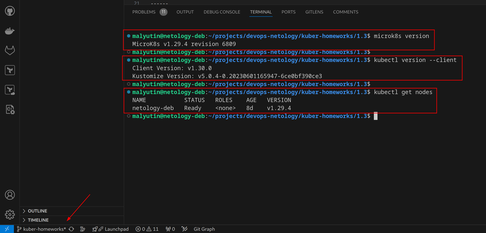
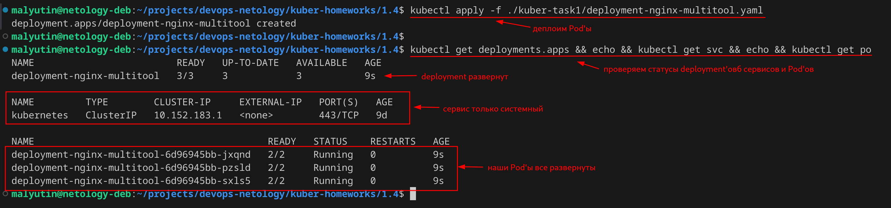
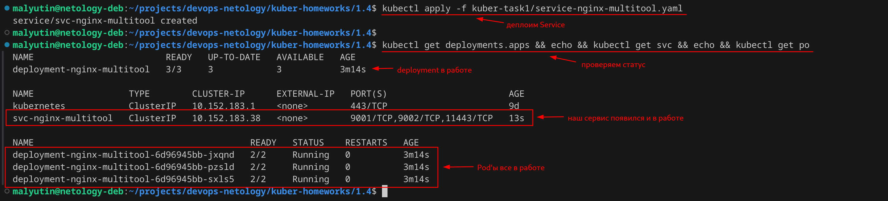
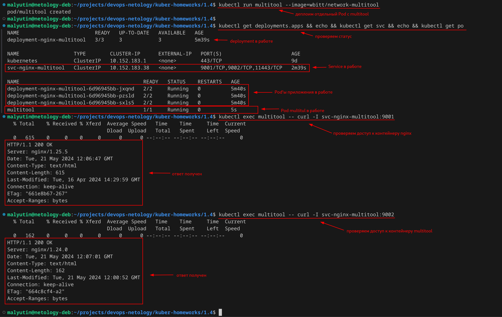
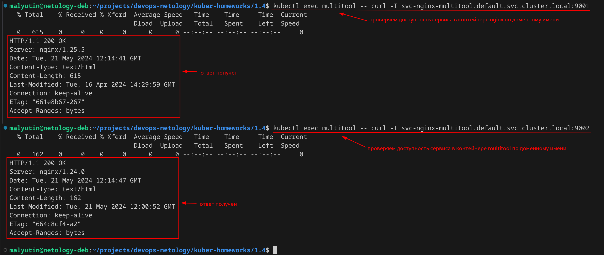
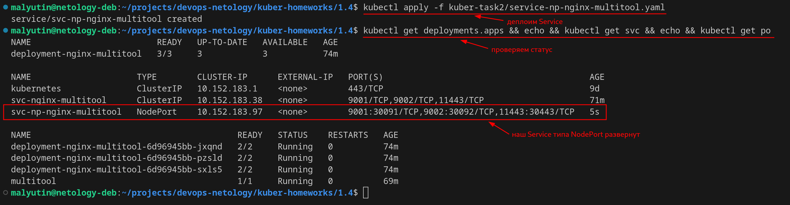
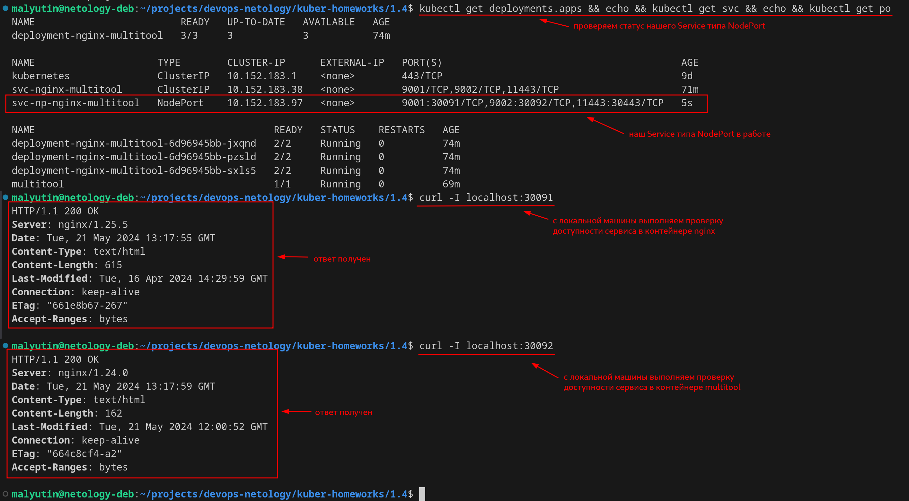

# Домашнее задание к занятию «Сетевое взаимодействие в K8S. Часть 1»

## Цель задания

В тестовой среде Kubernetes необходимо обеспечить доступ к приложению, установленному в предыдущем ДЗ и состоящему из двух контейнеров, по разным портам в разные контейнеры как внутри кластера, так и снаружи.

------

## Чеклист готовности к домашнему заданию

1. Установленное k8s-решение (например, MicroK8S).
2. Установленный локальный kubectl.
3. Редактор YAML-файлов с подключённым Git-репозиторием.



------

### Задание 1. Создать Deployment и обеспечить доступ к контейнерам приложения по разным портам из другого Pod внутри кластера

1. Создать Deployment приложения, состоящего из двух контейнеров (nginx и multitool), с количеством реплик 3 шт.

Создал манифест для deployment'а, состоящего из двух контейнеров (`nginx` и `multitool`), с количеством реплик 3 - [deployment-nginx-multitool.yaml](./kuber-task1/deployment-nginx-multitool.yaml)

```yaml
apiVersion: apps/v1
kind: Deployment
metadata:
  name: deployment-nginx-multitool
  labels:
    app: nginx
spec:
  replicas: 3
  selector:
    matchLabels:
      app: nginx
  template:
    metadata:
      labels:
        app: nginx
    spec:
      containers:
      - name: nginx
        image: nginx
        ports:
        - containerPort: 80
          name: http-nginx
      - name: multitool
        image: wbitt/network-multitool
        env:
        - name: HTTP_PORT
          value: "8080"
        - name: HTTPS_PORT
          value: "11443"
        ports:
        - containerPort: 8080
          name: http-multitool
        - containerPort: 11443
          name: https-multitool
```

Запуск deployment'а выполнен с помощью команды

```bash
kubectl apply -f ./kuber-task1/deployment-nginx-multitool.yaml
```

Результат представлен на скриншоте.



2. Создать Service, который обеспечит доступ внутри кластера до контейнеров приложения из п.1 по порту 9001 — nginx 80, по 9002 — multitool 8080.

Создал манифест для Service, который обеспечит доступ внутри кластера до контейнеров приложения из п.1 по порту 9001 — nginx 80, по 9002 — multitool 8080 - [service-nginx-multitool.yaml](./kuber-task1/service-nginx-multitool.yaml)

```yaml
apiVersion: v1
kind: Service
metadata:
  name: svc-nginx-multitool
spec:
  selector:
    app: nginx
  ports:
  - name: http-nginx
    port: 9001
    protocol: TCP
    targetPort: 80
  - name: http-multitool
    port: 9002
    protocol: TCP
    targetPort: 8080
  - name: https-multitool
    port: 11443
    protocol: TCP
    targetPort: 11443
```

Применил его командой

```bash
kubectl apply -f kuber-task1/service-nginx-multitool.yaml
```

Результат



3. Создать отдельный Pod с приложением multitool и убедиться с помощью `curl`, что из пода есть доступ до приложения из п.1 по разным портам в разные контейнеры.

Создал в кластере отдельный Pod с приложением `multitool` с помощью команды

```bash
kubectl run multitool --image=wbitt/network-multitool
```

Команды для проверки доступности приложений в контейнерах

```bash
kubectl exec multitool -- curl -I svc-nginx-multitool:9001
kubectl exec multitool -- curl -I svc-nginx-multitool:9002
```

Убедился с помощью `curl`, что из созданного пода есть доступ до приложения из п.1 по разным портам в разные контейнеры



4. Продемонстрировать доступ с помощью `curl` по доменному имени сервиса.

Команды для проверки доступности приложений в контейнерах по доменному имени сервиса

```bash
kubectl exec multitool -- curl -I svc-nginx-multitool.default.svc.cluster.local:9001
kubectl exec multitool -- curl -I svc-nginx-multitool.default.svc.cluster.local:9002
```

Демнострация доступа с помощью `curl` по доменному имени сервиса из п.2



5. Предоставить манифесты Deployment и Service в решении, а также скриншоты или вывод команды п.4.

Манифесты Deployment и Service, а также скриншоты выполнения команды п.4 представлены выше.

------

### Задание 2. Создать Service и обеспечить доступ к приложениям снаружи кластера

1. Создать отдельный Service приложения из Задания 1 с возможностью доступа снаружи кластера к nginx, используя тип `NodePort`.

Создал манифест для Service приложения из Задания 1 с возможностью доступа снаружи кластера к nginx, используя тип `NodePort` - [service-np-nginx-multitool.yaml](./kuber-task2/service-np-nginx-multitool.yaml)

```yaml
apiVersion: v1
kind: Service
metadata:
  name: svc-np-nginx-multitool
spec:
  type: NodePort
  selector:
    app: nginx
  ports:
  - name: http-nginx
    port: 9001
    protocol: TCP
    targetPort: 80
    nodePort: 30091
  - name: http-multitool
    port: 9002
    protocol: TCP
    targetPort: 8080
    nodePort: 30092
  - name: https-multitool
    port: 11443
    protocol: TCP
    targetPort: 11443
    nodePort: 30443
```

Применил его командой

```bash
kubectl apply -f kuber-task1/service-np-nginx-multitool.yaml
```

Результат



2. Продемонстрировать доступ с помощью браузера или `curl` с локального компьютера.

Команды для проверки доступности приложений в контейнерах с помощью `curl` с локального компьютера

```bash
curl -I localhost:30091
curl -I localhost:30092
```

Демнострация доступа с помощью `curl` с локального компьютера



3. Предоставить манифест и Service в решении, а также скриншоты или вывод команды п.2.

Манифест Service, а также скриншоты выполнения команды п.2 представлены выше.
