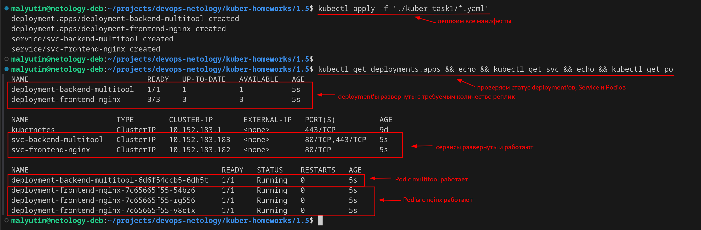
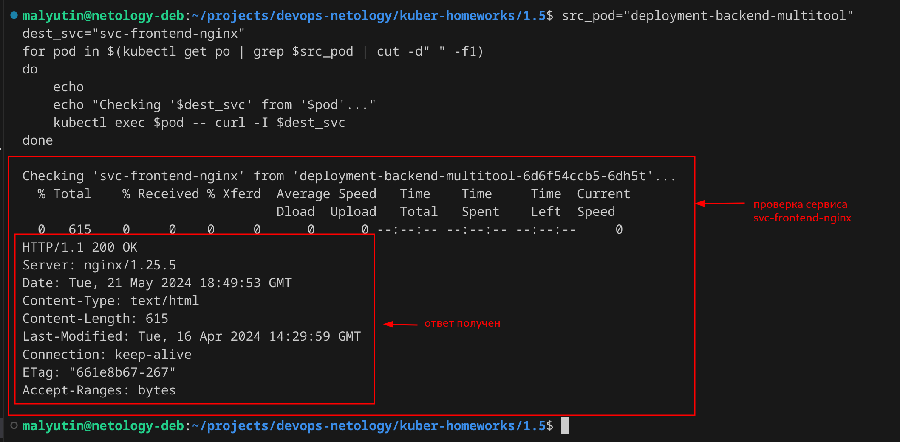
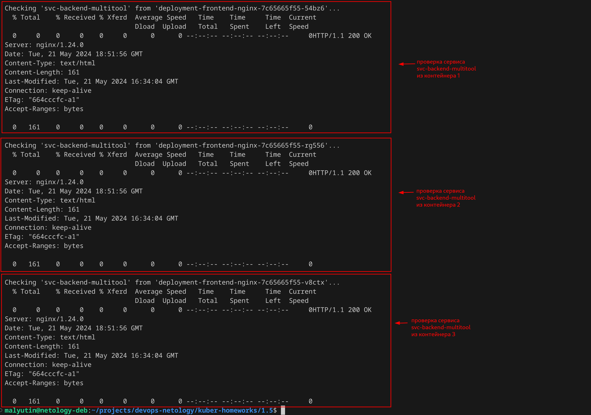
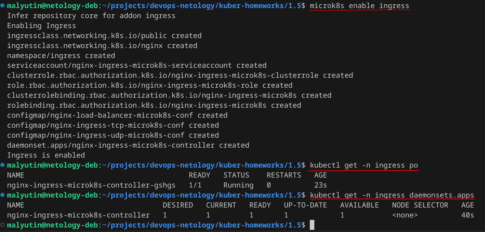
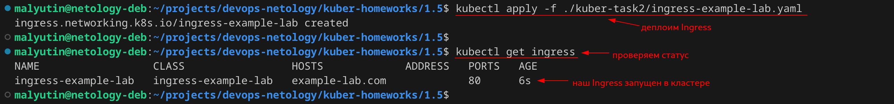
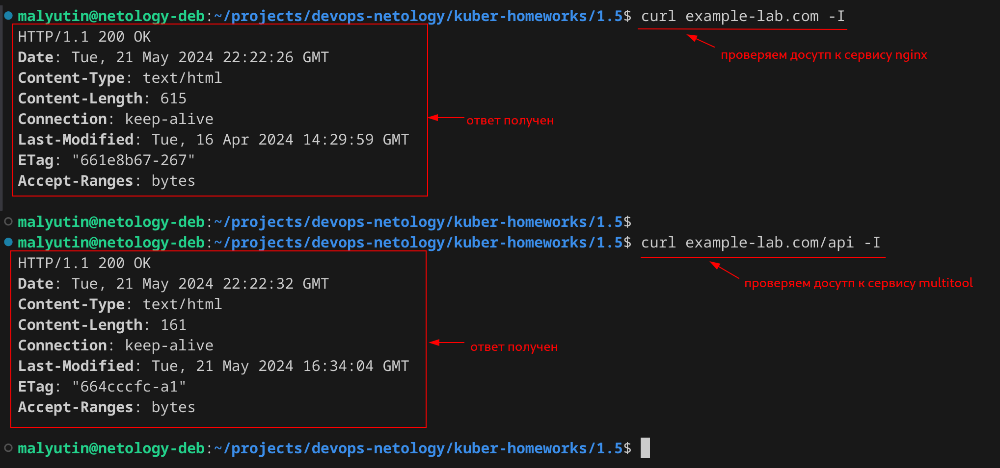

# Домашнее задание к занятию «Сетевое взаимодействие в K8S. Часть 2»

## Цель задания

В тестовой среде Kubernetes необходимо обеспечить доступ к двум приложениям снаружи кластера по разным путям.

------

## Чеклист готовности к домашнему заданию

1. Установленное k8s-решение (например, MicroK8S).
2. Установленный локальный kubectl.
3. Редактор YAML-файлов с подключённым Git-репозиторием.


------

### Задание 1. Создать Deployment приложений backend и frontend

1. Создать Deployment приложения _frontend_ из образа `nginx` с количеством реплик 3 шт.

Создал манифест для deployment'а приложения _frontend_ из образа `nginx` с количеством реплик 3 шт. - [deployment-frontend-nginx.yaml](./kuber-task1/deployment-frontend-nginx.yaml)

```yaml
apiVersion: apps/v1
kind: Deployment
metadata:
  name: deployment-frontend-nginx
  labels:
    app: nginx
spec:
  replicas: 3
  selector:
    matchLabels:
      app: nginx
  template:
    metadata:
      labels:
        app: nginx
    spec:
      containers:
      - name: nginx
        image: nginx
        ports:
        - containerPort: 80
          name: http-nginx
```

2. Создать Deployment приложения _backend_ из образа `multitool`.

Создал манифест для deployment'а приложения _backend_ из образа `multitool` - [deployment-backend-multitool.yaml](./kuber-task1/deployment-backend-multitool.yaml)

```yaml
apiVersion: apps/v1
kind: Deployment
metadata:
  name: deployment-backend-multitool
  labels:
    app: multitool
spec:
  replicas: 1
  selector:
    matchLabels:
      app: multitool
  template:
    metadata:
      labels:
        app: multitool
    spec:
      containers:
      - name: multitool
        image: wbitt/network-multitool
        ports:
        - containerPort: 80
          name: http-multitool
        - containerPort: 443
          name: https-multitool
```

3. Добавить Service, которые обеспечат доступ к обоим приложениям внутри кластера.

Создал под каждый deploymentсвой Service, которые обеспечат доступ к обоим приложениям внутри кластера

Service для deployment'а `deployment-frontend-nginx` - [service-frontend-nginx.yaml](./kuber-task1/service-frontend-nginx.yaml)

```yaml
apiVersion: v1
kind: Service
metadata:
  name: svc-frontend-nginx
spec:
  selector:
    app: nginx
  ports:
  - name: http-nginx
    port: 80
    protocol: TCP
    targetPort: 80
```

Service для deployment'а `deployment-backend-multitool` - [service-backend-multitool.yaml](./kuber-task1/service-backend-multitool.yaml)

```yaml
apiVersion: v1
kind: Service
metadata:
  name: svc-backend-multitool
spec:
  selector:
    app: multitool
  ports:
  - name: http-multitool
    port: 80
    protocol: TCP
    targetPort: 80
  - name: https-multitool
    port: 443
    protocol: TCP
    targetPort: 443
```

4. Продемонстрировать, что приложения видят друг друга с помощью Service.

Деплоим все манифесты командой

```bash
kubectl apply -f './kuber-task1/*.yaml'
```

Проверяем, что все Pod'ы и Service развернулись и работают в кластере без ошибок



Выполняем взаимную проверку доступности приложений через Service

**Проверка доступности сервиса `svc-frontend-nginx` для Pod'ов, развернутых deployment'ом `deployment-frontend-nginx`, из Pod'а `deployment-backend-multitool`**

```bash
src_pod="deployment-backend-multitool"
dest_svc="svc-frontend-nginx"
for pod in $(kubectl get po | grep $src_pod | cut -d" " -f1)
do
    echo
    echo "Checking '$dest_svc' from '$pod'..."
    kubectl exec $pod -- curl -I $dest_svc
done
```

Результат проверки



**Проверка доступности сервиса `svc-backend-multitool` для Pod'ов, развернутых deployment'ом `deployment-backend-multitool` из Pod'ов `deployment-frontend-nginx`**

```bash
src_pod="deployment-frontend-nginx"
dest_svc="svc-backend-multitool"
for pod in $(kubectl get po | grep $src_pod | cut -d" " -f1)
do
    echo
    echo "Checking '$dest_svc' from '$pod'..."
    kubectl exec $pod -- curl -I $dest_svc
done
```

Результат проверки



5. Предоставить манифесты Deployment и Service в решении, а также скриншоты или вывод команды п.4.

Манифесты Deployment и Service, а также скриншоты выполнения команды п.4 представлены выше.

------

### Задание 2. Создать Ingress и обеспечить доступ к приложениям снаружи кластера

1. Включить Ingress-controller в MicroK8S.

Включил Ingress-controller в MicroK8S командой

```bash
microk8s enable ingress
```



2. Создать Ingress, обеспечивающий доступ снаружи по IP-адресу кластера MicroK8S так, чтобы при запросе только по адресу открывался _frontend_ а при добавлении /api - _backend_.

Создал Ingress, обеспечивающий доступ снаружи по IP-адресу кластера MicroK8S так, чтобы при запросе только по адресу открывался _frontend_ а при добавлении /api - _backend_ - [ingress-example-lab.yaml](./kuber-task2/ingress-example-lab.yaml)

```yaml
apiVersion: networking.k8s.io/v1
kind: Ingress
metadata:
  name: ingress-example-lab
  annotations:
    nginx.ingress.kubernetes.io/rewrite-target: /
spec:
  ingressClassName: nginx
  rules:
  - host: example-lab.com
    http:
      paths:
      - path: /
        pathType: Prefix
        backend:
          service:
            name: svc-frontend-nginx
            port:
              number: 80
      - path: /api
        pathType: Prefix
        backend:
          service:
            name: svc-backend-multitool
            port:
              number: 80
```

Задеплоил Ingress в кластер командой

```bash
kubectl apply -f ./kuber-task2/ingress-example-lab.yaml
```

Проверил, что деплой в кластер выполнен успешно



3. Продемонстрировать доступ с помощью браузера или `curl` с локального компьютера.

Проверяем доступ к сервисам с локального компьютера с помощью команд (в файл `/etc/hosts` предварительно была добавлена запись для домена `example-lab.com`)

```bash
curl example-lab.com -I
curl example-lab.com/api -I
```

Результат проверки



*Различия можно увидеть в значении **ETag***

4. Предоставить манифесты и скриншоты или вывод команды п.2.

Манифесты и скриншоты команды п.2 представлены выше.
