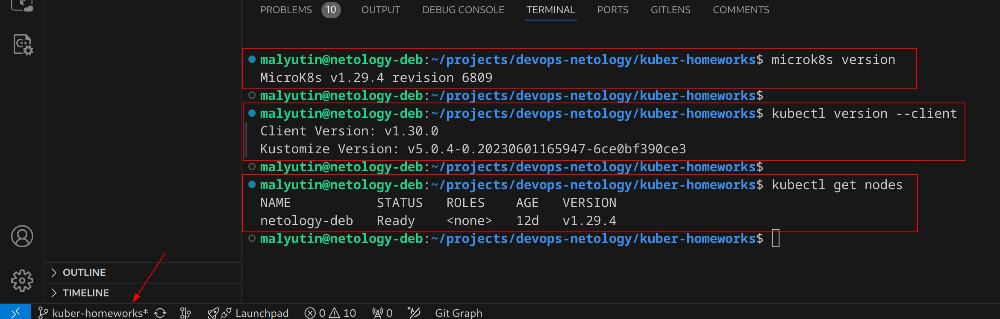
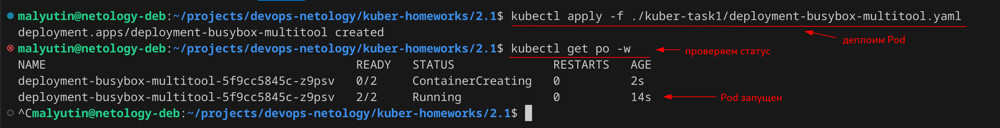
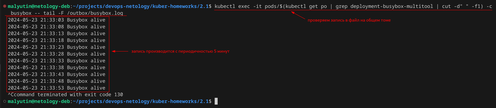
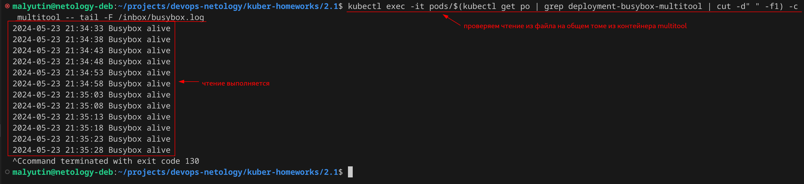
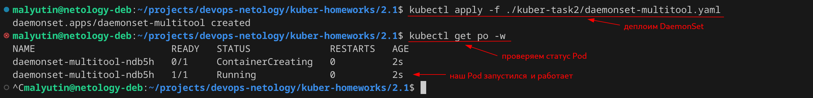
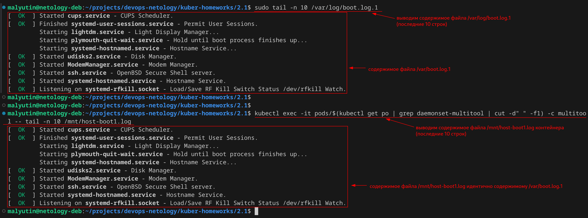

# Домашнее задание к занятию «Хранение в K8s. Часть 1»

## Цель задания

В тестовой среде Kubernetes нужно обеспечить обмен файлами между контейнерам пода и доступ к логам ноды.

------

## Чеклист готовности к домашнему заданию

1. Установленное K8s-решение (например, MicroK8S).
2. Установленный локальный kubectl.
3. Редактор YAML-файлов с подключенным GitHub-репозиторием.



------

### Задание 1

**Что нужно сделать**

Создать Deployment приложения, состоящего из двух контейнеров и обменивающихся данными.

1. Создать Deployment приложения, состоящего из контейнеров busybox и multitool.

Создал манифест Deployment приложения, состоящего из контейнеров `busybox` и `multitool`, с типом тома `emptyDir` - [deployment-busybox-multitool.yaml](./kuber-task1/deployment-busybox-multitool.yaml)

```yaml
apiVersion: apps/v1
kind: Deployment
metadata:
  name: deployment-busybox-multitool
  labels:
    app: task1
spec:
  replicas: 1
  selector:
    matchLabels:
      app: task1
  template:
    metadata:
      labels:
        app: task1
    spec:
      volumes:
      - name: shared-volume
        emptyDir:
      containers:
      - name: busybox
        image: busybox
        command:
          - "sh"
          - "-c"
          - "while true; do echo $(date +'%Y-%m-%d %H:%M:%S') 'Busybox alive' >> /outbox/busybox.log && sleep 5; done"
        volumeMounts:
        - mountPath: /outbox
          name: shared-volume
      - name: multitool
        image: wbitt/network-multitool
        command:
          - "sh"
          - "-c"
          - "while [ ! -f /inbox/busybox.log ]; do sleep 1; done && tail -F /inbox/busybox.log"
        ports:
        - containerPort: 80
          name: http-multitool
        - containerPort: 443
          name: https-multitool
        volumeMounts:
        - mountPath: /inbox
          name: shared-volume
```

2. Сделать так, чтобы `busybox` писал каждые пять секунд в некий файл в общей директории.

Выполнение требования обеспечивается следующей командой в контейнере `busybox`

```yaml
command:
    - "sh"
    - "-c"
    - "while true; do echo $(date +'%Y-%m-%d %H:%M:%S') 'Busybox alive' >> /outbox/busybox.log && sleep 5; done"
```

3. Обеспечить возможность чтения файла контейнером `multitool`.

Выполнение требования обеспечивается следующей командой в контейнере `multitool`

```yaml
command:
    - "sh"
    - "-c"
    - "while [ ! -f /inbox/busybox.log ]; do sleep 1; done && tail -F /inbox/busybox.log"
```

4. Продемонстрировать, что multitool может читать файл, который периодоически обновляется.

Деплоим манифест командой

```bash
kubectl apply -f ./kuber-task1/deployment-busybox-multitool.yaml
```

Проверяем, что Pod задеплоен и работает в кластере без ошибок



Демонстрация факта записи контейнером `busybox` в файл `/outbox/busybox.log` в общей директории

Команда для проверки

```bash
kubectl exec -it pods/$(kubectl get po | grep deployment-busybox-multitool | cut -d" " -f1) -c busybox -- tail -F /outbox/busybox.log
```

Результат проверки



Демонстрация факта чтения контейнером `multitool` файла `/inbox/busybox.log` в общей директории

Команда для проверки

```bash
kubectl exec -it pods/$(kubectl get po | grep deployment-busybox-multitool | cut -d" " -f1) -c multitool -- tail -F /inbox/busybox.log
```

Результат проверки



5. Предоставить манифесты Deployment в решении, а также скриншоты или вывод команды из п. 4.

Манифест Deployment, а также скриншоты из п.4 представлены выше.

------

### Задание 2

**Что нужно сделать**

Создать DaemonSet приложения, которое может прочитать логи ноды.

1. Создать DaemonSet приложения, состоящего из `multitool`.

Создал манифест DaemonSet приложения, состоящего из контейнера `multitool` - [daemonset-multitool.yaml](./kuber-task2/daemonset-multitool.yaml)

```yaml
apiVersion: apps/v1
kind: DaemonSet
metadata:
  name: daemonset-multitool
  labels:
    app: task2
spec:
  selector:
    matchLabels:
      app: task2
  template:
    metadata:
      labels:
        app: task2
    spec:
      volumes:
      - name: host-volume
        hostPath:
          path: /var/log/boot.log.1
          type: File
      containers:
      - name: multitool
        image: wbitt/network-multitool
        ports:
        - containerPort: 80
          name: http-multitool
        - containerPort: 443
          name: https-multitool
        volumeMounts:
        - mountPath: /mnt/host-boot1.log
          name: host-volume
```

2. Обеспечить возможность чтения файла `/var/log/syslog` кластера MicroK8S.

> *В моем установленном дистрибутиве Linux уже почти все логи пишутся в `journald`, поэтому файла `/var/log/syslog` у меня нет в системе. Для демонстрации буду использовать файл `/var/log/boot.log.1`.*

Для этого определяю том с типом `File`, чтобы не монтировать в контейнер все содержимое директории `/var/log` хоста (ноды).

```yaml
volumes:
- name: host-volume
  hostPath:
    path: /var/log/boot.log.1
    type: File
```

И монтирую его в контейнер `multitool`

```yaml
volumeMounts:
- mountPath: /mnt/host-boot1.log
  name: host-volume
```

3. Продемонстрировать возможность чтения файла изнутри пода.

Деплою в кластер DaemonSet командой

```bash
kubectl apply -f ./kuber-task2/daemonset-multitool.yaml
```

Проверяю статус деплоя DaemonSet'а



Cодержимое файла `/var/log/boot.log.1` хоста (ноды) проверяю командой

```bash
sudo tail -n 10 /var/log/boot.log.1
```

Cодержимое файла `/mnt/host-boot1.log`, смонтированного в контейнер,  проверяю командой

```bash
kubectl exec -it pods/$(kubectl get po | grep daemonset-multitool | cut -d" " -f1) -c multitool -- tail -n 10 /mnt/host-boot1.log
```

Результат проверки




4. Предоставить манифесты Deployment, а также скриншоты или вывод команды из п.2.

Манифест Deployment'а, а также скриншоты из п.2 представлены выше.
