# Домашнее задание к занятию «Хранение в K8s. Часть 2»

## Цель задания

В тестовой среде Kubernetes нужно создать PV и продемострировать запись и хранение файлов.

------

## Чеклист готовности к домашнему заданию

1. Установленное K8s-решение (например, MicroK8S).
2. Установленный локальный kubectl.
3. Редактор YAML-файлов с подключенным GitHub-репозиторием.

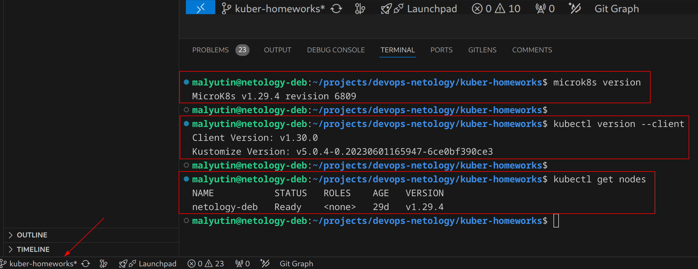

------

## Задание 1

**Что нужно сделать**

Создать Deployment приложения, использующего локальный PV, созданный вручную.

1. Создать Deployment приложения, состоящего из контейнеров busybox и multitool.

Создал Deployment приложения, состоящего из контейнеров busybox и multitool - [deployment-busybox-multitool.yaml](./task1/deployment-busybox-multitool.yaml)

```yaml
apiVersion: apps/v1
kind: Deployment
metadata:
  name: deployment-busybox-multitool
  labels:
    app: task1
spec:
  replicas: 1
  selector:
    matchLabels:
      app: task1
  template:
    metadata:
      labels:
        app: task1
    spec:
      volumes:
      - name: volume-local-node
        persistentVolumeClaim:
          claimName: pvc-localhost
      containers:
      - name: busybox
        image: busybox
        command:
          - "sh"
          - "-c"
          - "while true; do echo $(date +'%Y-%m-%d %H:%M:%S') 'Busybox alive' >> /outbox/busybox.log && sleep 5; done"
        volumeMounts:
        - mountPath: /outbox
          name: volume-local-node
      - name: multitool
        image: wbitt/network-multitool
        command:
          - "sh"
          - "-c"
          - "while [ ! -f /inbox/busybox.log ]; do sleep 1; done && tail -F /inbox/busybox.log"
        ports:
        - containerPort: 80
          name: http-multitool
        - containerPort: 443
          name: https-multitool
        volumeMounts:
        - mountPath: /inbox
          name: volume-local-node
```

2. Создать PV и PVC для подключения папки на локальной ноде, которая будет использована в поде.

Создал PV и PVC для подключения папки на локальной ноде, которая будет использована в поде.

PV - [pv-local.yaml](./task1/pv-local.yaml)

```yaml
apiVersion: v1
kind: PersistentVolume
metadata:
  name: pv-local
spec:
  storageClassName: manual
  capacity:
    storage: 150Mi
  accessModes:
    - ReadWriteOnce
  hostPath:
    path: /storage/pv-local
```

PVC - [pvc-local.yaml](./task1/pvc-local.yaml)

```yaml
apiVersion: v1
kind: PersistentVolumeClaim
metadata:
  name: pvc-local
spec:
  storageClassName: manual
  volumeMode: Filesystem
  accessModes:
    - ReadWriteOnce
  resources:
    requests:
      storage: 150Mi
```

3. Продемонстрировать, что multitool может читать файл, в который busybox пишет каждые пять секунд в общей директории.

Выполнение требования "busybox пишет каждые пять секунд в общей директории" обеспечивается следующей командой в контейнере `busybox`

```yaml
command:
    - "sh"
    - "-c"
    - "while true; do echo $(date +'%Y-%m-%d %H:%M:%S') 'Busybox alive' >> /outbox/busybox.log && sleep 5; done"
```

Выполнение требования "multitool может читать файл, в который busybox пишет каждые пять секунд в общей директории" обеспечивается следующей командой в контейнере `multitool` и нормальной работой конейнера `multitool`

```yaml
command:
    - "sh"
    - "-c"
    - "while [ ! -f /inbox/busybox.log ]; do sleep 1; done && tail -F /inbox/busybox.log"
```

Задеплоил в кластер созданные PV и PVC и проверил, что PV и PVC задеплоены в кластер и PVC присоединен к PV.

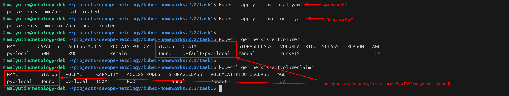

Задеплоил в кластер созданный Deployment командой и проверил, что контейнеры deployment'а запустились и работают в нормальном режиме, без ошибок.

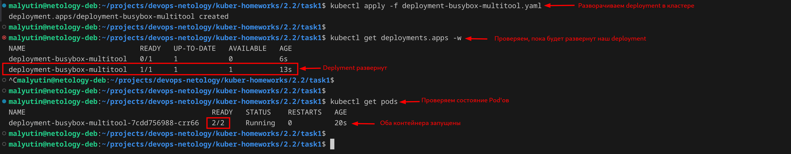

Демонстрация факта записи контейнером `busybox` в файл `/outbox/busybox.log` в общей директории

Команда для проверки

```bash
kubectl exec -it pods/$(kubectl get po | grep deployment-busybox-multitool | cut -d" " -f1) -c busybox -- tail -F /outbox/busybox.log
```

Результат проверки

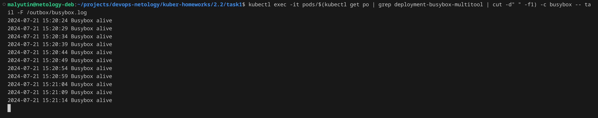

Демонстрация факта чтения контейнером `multitool` файла `/inbox/busybox.log` в общей директории

Команда для проверки

```bash
kubectl exec -it pods/$(kubectl get po | grep deployment-busybox-multitool | cut -d" " -f1) -c multitool -- tail -F /inbox/busybox.log
```

Результат проверки

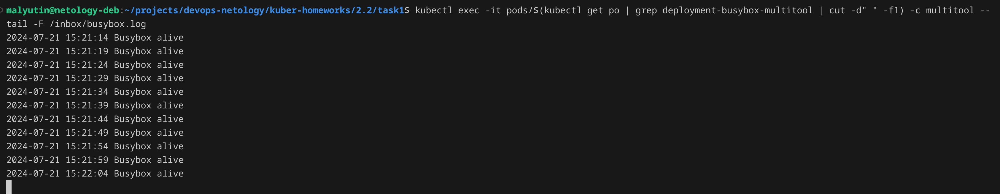

4. Удалить Deployment и PVC. Продемонстрировать, что после этого произошло с PV. Пояснить, почему.

Удалил Deployment и PVC командой

```bash
kubectl delete -f deployment-busybox-multitool.yaml
kubectl delete -f pvc-local.yaml
```

Проверил, что deployment и PVC удалены

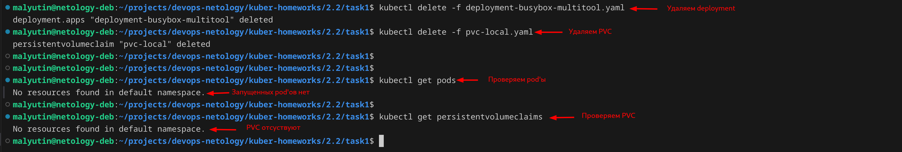

После удаления PVC PV перешел в состояние `Released` ("извлечен") - к PV не присоединен ни один PVC.

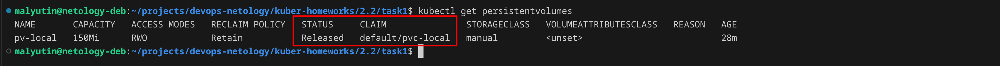

5. Продемонстрировать, что файл сохранился на локальном диске ноды. Удалить PV.  Продемонстрировать что произошло с файлом после удаления PV. Пояснить, почему.

Файл сохранился на локальном диске ноды.

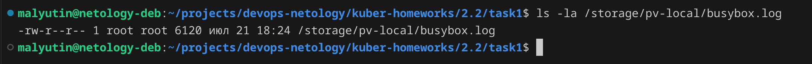

Удалил PV командой

```bash
kubectl delete -f pv-local.yaml
```

Проверил наличие файла на локальном диске ноды командой

```bash
ls -la /storage/pv-local/busybox.log
```

Результат

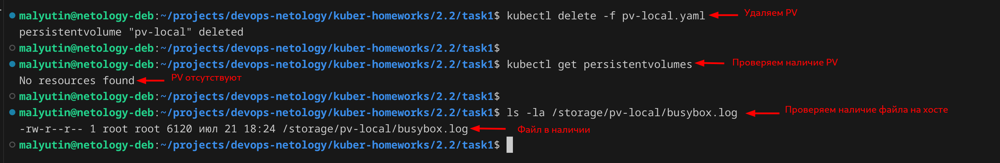

После удаления PV файл присутствует на локальном диске ноды потому что в спецификации манифеста PV явно не указан параметр `persistentVolumeReclaimPolicy` и по умолчанию PV было создано (см. скриншоты выше) с ReclaimPolicy = Retain (после удаления PV ресурсы из внешних провайдеров автоматически не удаляются).

6. Предоставить манифесты, а также скриншоты или вывод необходимых команд.

Манифесты и скриншоты представлены выше.

------

## Задание 2

**Что нужно сделать**

Создать Deployment приложения, которое может хранить файлы на NFS с динамическим созданием PV.

1. Включить и настроить NFS-сервер на MicroK8S.

Включил и настроил NFS-сервер на MicroK8S с помощью команд

```bash
microk8s.helm repo add stable https://charts.helm.sh/stable && microk8s.helm repo update
microk8s.helm install nfs-server stable/nfs-server-provisioner
```

Проверил, что NFS-сервер запустился и работает в кластере, а так-же появился новый StorageClass

```bash
kubectl get pods
kubectl get sc
```

Результат

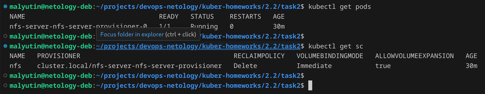

2. Создать Deployment приложения состоящего из multitool, и подключить к нему PV, созданный автоматически на сервере NFS.

Создал Deployment приложения, состоящего из контейнера `multitool` - [deployment-multitool.yaml](./task2/deployment-multitool.yaml)

```yaml
apiVersion: apps/v1
kind: Deployment
metadata:
  name: deployment-multitool
  labels:
    app: task2
spec:
  replicas: 1
  selector:
    matchLabels:
      app: task2
  template:
    metadata:
      labels:
        app: task2
    spec:
      volumes:
      - name: volume-nfs
        persistentVolumeClaim:
          claimName: pvc-nfs
      containers:
      - name: multitool
        image: wbitt/network-multitool
        ports:
        - containerPort: 80
          name: http-multitool
        - containerPort: 443
          name: https-multitool
        volumeMounts:
        - mountPath: /nfs-volume
          name: volume-nfs
```

Создал PVC для использования ранее установленного сервера NFS - [pvc-nfs.yaml](./task2/pvc-nfs.yaml)

```yaml
apiVersion: v1
kind: PersistentVolumeClaim
metadata:
  name: pvc-nfs
spec:
  storageClassName: nfs
  accessModes:
    - ReadWriteOnce
  resources:
    requests:
      storage: 15Mi
```

Задеплоил манифесты PVC и deployment'а в кластер командами

```bash
kubectl apply -f pvc-nfs.yaml
kubectl apply -f deployment-multitool.yaml
```

Результат

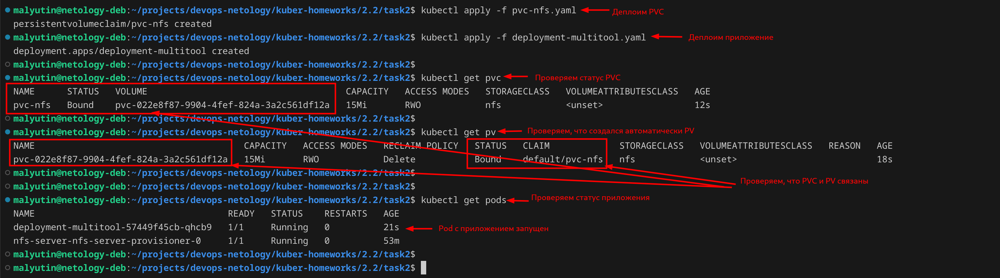

3. Продемонстрировать возможность чтения и записи файла изнутри пода.

Заходим внутрь созданного Pod'а и првиеряем возможность чтения и записи файла изнутри пода на подключенном томе NFS-сервера

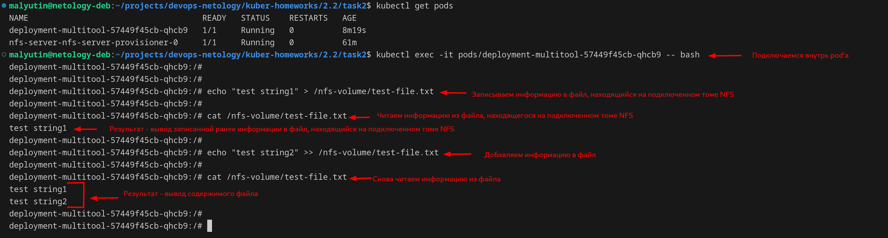

4. Предоставить манифесты, а также скриншоты или вывод необходимых команд.

Манифесты и скриншоты представлены выше.
