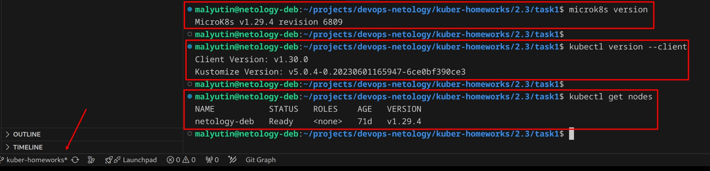
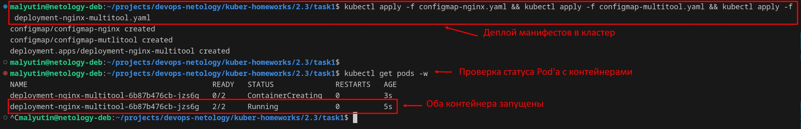
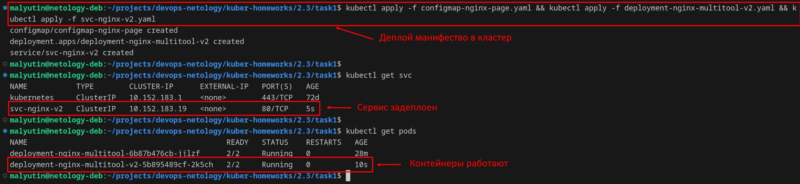
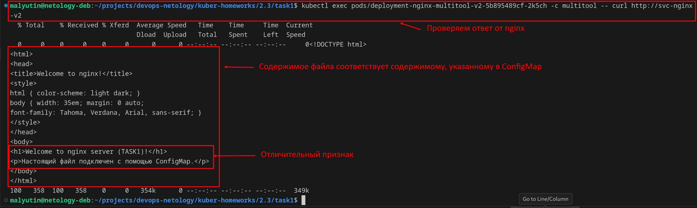
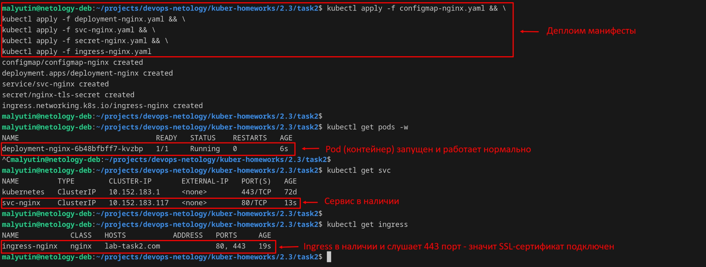
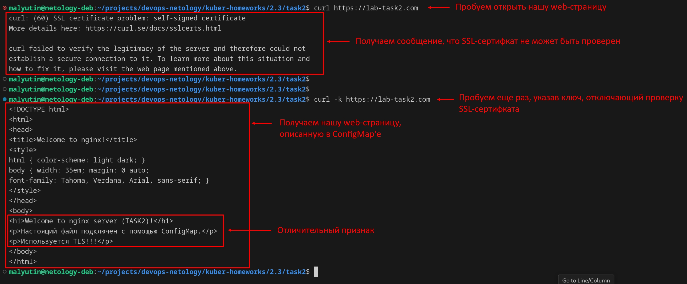

# Домашнее задание к занятию «Конфигурация приложений»

## Цель задания

В тестовой среде Kubernetes необходимо создать конфигурацию и продемонстрировать работу приложения.

------

## Чеклист готовности к домашнему заданию

1. Установленное K8s-решение (например, MicroK8s).
2. Установленный локальный kubectl.
3. Редактор YAML-файлов с подключённым GitHub-репозиторием.



------

## Задание 1. Создать Deployment приложения и решить возникшую проблему с помощью ConfigMap. Добавить веб-страницу

1. Создать Deployment приложения, состоящего из контейнеров nginx и multitool.
2. Решить возникшую проблему с помощью ConfigMap.

Создал ConfigMap [configmap-multitool.yaml](./task1/configmap-multitool.yaml), в котором определил порты для контейнера `multitool`.

```yaml
apiVersion: v1
kind: ConfigMap
metadata:
  name: configmap-mutlitool
data:
  multitool-http-port: "10080"
  multitool-https-port: "10443"
```

 Создал ConfigMap для контейнера `nginx` - [configmap-nginx.yaml](./task1/configmap-nginx.yaml).

```yaml
apiVersion: v1
kind: ConfigMap
metadata:
  name: configmap-nginx
data:
  nginx-http-port: "80"
```

Создал Deployment'е приложения, состоящего из контейнеров `nginx` и `multitool` - [deployment-nginx-multitool.yaml](./task1/deployment-nginx-multitool.yaml). Использовал значения переменных из созданных ConfigMap'ов для передачи параметров `HTTP_PORT` и `HTTPS_PORT` контейнеру `multitool` и `NGINX_PORT` контейнеру `nginx`.

```yaml
apiVersion: apps/v1
kind: Deployment
metadata:
  name: deployment-nginx-multitool
  labels:
    app: task1
spec:
  replicas: 1
  selector:
    matchLabels:
      app: task1
  template:
    metadata:
      labels:
        app: task1
    spec:
      containers:
      - name: nginx
        image: nginx
        env:
        - name: NGINX_PORT
          valueFrom:
            configMapKeyRef:
              name: configmap-nginx
              key: nginx-http-port
      - name: multitool
        image: wbitt/network-multitool
        env:
        - name: HTTP_PORT
          valueFrom:
            configMapKeyRef:
              name: configmap-mutlitool
              key: multitool-http-port
        - name: HTTPS_PORT
          valueFrom:
            configMapKeyRef:
              name: configmap-mutlitool
              key: multitool-https-port
```

3. Продемонстрировать, что pod стартовал и оба конейнера работают.

Задеплоил созданные манифесты в кластер командой

```bash
kubectl apply -f configmap-nginx.yaml && \
kubectl apply -f configmap-multitool.yaml && \
kubectl apply -f deployment-nginx-multitool.yaml
```

Контейнеры запустились и работают нормально.



4. Сделать простую веб-страницу и подключить её к Nginx с помощью ConfigMap. Подключить Service и показать вывод curl или в браузере.

Создал ConfigMap, содержащий простую web-страницу - [configmap-nginx-page.yaml](./task1/configmap-nginx-page.yaml)

```yaml
apiVersion: v1
kind: ConfigMap
metadata:
  name: configmap-nginx-page
data:
  index.html: |
    <!DOCTYPE html>
    <html>
    <head>
    <title>Welcome to nginx!</title>
    <style>
    html { color-scheme: light dark; }
    body { width: 35em; margin: 0 auto;
    font-family: Tahoma, Verdana, Arial, sans-serif; }
    </style>
    </head>
    <body>
    <h1>Welcome to nginx server (TASK1)!</h1>
    <p>Настоящий файл подключен с помощью ConfigMap.</p>
    </body>
    </html>
```

Создал новую версию Deployment'а, использующий созданный ConfigMap с простой web-страницей - [deployment-nginx-multitool-v2.yaml](./task1/deployment-nginx-multitool-v2.yaml)

```yaml
apiVersion: apps/v1
kind: Deployment
metadata:
  name: deployment-nginx-multitool-v2
  labels:
    app: task1-4
spec:
  replicas: 1
  selector:
    matchLabels:
      app: task1-4
  template:
    metadata:
      labels:
        app: task1-4
    spec:
      containers:
      - name: nginx
        image: nginx
        volumeMounts:
        - name: configmap-nginx-volume
          mountPath: /usr/share/nginx/html/index.html
          subPath: index.html
        env:
        - name: NGINX_PORT
          valueFrom:
            configMapKeyRef:
              name: configmap-nginx
              key: nginx-http-port
      - name: multitool
        image: wbitt/network-multitool
        env:
        - name: HTTP_PORT
          valueFrom:
            configMapKeyRef:
              name: configmap-mutlitool
              key: multitool-http-port
        - name: HTTPS_PORT
          valueFrom:
            configMapKeyRef:
              name: configmap-mutlitool
              key: multitool-https-port
      volumes:
      - name: configmap-nginx-volume
        configMap:
          name: configmap-nginx-page
```

Создал Service - [svc-nginx-v2.yaml](./task1/svc-nginx-v2.yaml)

```yaml
apiVersion: v1
kind: Service
metadata:
  name: svc-nginx-v2
spec:
  selector:
    app: task1-4
  ports:
  - name: http-nginx
    port: 80
    protocol: TCP
    targetPort: 80
```

Задеплоил созданные манифесты командой

```bash
kubectl apply -f configmap-nginx-page.yaml && \
kubectl apply -f deployment-nginx-multitool-v2.yaml && \
kubectl apply -f svc-nginx-v2.yaml
```

Проверил, что все объекты создались и контейнеры запустились



Убедился, что открывается web-страница, идентичная указанной лг в созданном ConfigMap'е.



5. Предоставить манифесты, а также скриншоты или вывод необходимых команд.

Манифесты и скриншоты представлены выше.

------

## Задание 2. Создать приложение с вашей веб-страницей, доступной по HTTPS

1. Создать Deployment приложения, состоящего из Nginx.

Создать Deployment приложения, состоящего из Nginx - [deployment-nginx.yaml](./task2/deployment-nginx.yaml)

```yaml
apiVersion: apps/v1
kind: Deployment
metadata:
  name: deployment-nginx
  labels:
    app: task2
spec:
  replicas: 1
  selector:
    matchLabels:
      app: task2
  template:
    metadata:
      labels:
        app: task2
    spec:
      containers:
      - name: nginx
        image: nginx
        volumeMounts:
        - name: configmap-nginx-volume
          mountPath: /usr/share/nginx/html/index.html
          subPath: index.html
        env:
        - name: NGINX_PORT
          valueFrom:
            configMapKeyRef:
              name: configmap-nginx
              key: nginx-http-port
      volumes:
      - name: configmap-nginx-volume
        configMap:
          name: configmap-nginx
```

2. Создать собственную веб-страницу и подключить её как ConfigMap к приложению.

Создал ConfigMap, содержащий страницу приложения - [configmap-nginx.yaml](./task2/configmap-nginx.yaml)

```yaml
apiVersion: v1
kind: ConfigMap
metadata:
  name: configmap-nginx
data:
  nginx-http-port: "80"
  index.html: |
    <!DOCTYPE html>
    <html>
    <head>
    <title>Welcome to nginx!</title>
    <style>
    html { color-scheme: light dark; }
    body { width: 35em; margin: 0 auto;
    font-family: Tahoma, Verdana, Arial, sans-serif; }
    </style>
    </head>
    <body>
    <h1>Welcome to nginx server (TASK2)!</h1>
    <p>Настоящий файл подключен с помощью ConfigMap.</p>
    <p>Используется TLS!!!</p>
    </body>
    </html>
```

3. Выпустить самоподписной сертификат SSL. Создать Secret для использования сертификата.

Создал самоподписанный сертификат SSL командой

```bash
openssl req -x509 -nodes -days 365 -newkey rsa:2048 -keyout server-key.pem -out server.pem -subj "/CN=lab-task2.com/O=lab-task2.com"
```

Создал Secret типа `tls` для использования самоподписанного сертификата SSL командой

```bash
kubectl create secret tls nginx-tls-secret --key=server-key.pem --cert=server.pem --dry-run=client --output=yaml > secret-nginx.yaml
```

В результате получил манифест - [secret-nginx.yaml](./task2/secret-nginx.yaml)

```yaml
apiVersion: v1
data:
  tls.crt: LS0tLS1CRUdJTiBDRVJUSUZJQ0FURS0tLS0tCk1JSURRVENDQWltZ0F3SUJBZ0lVTHk2ZXMzOWxBVHV1VGtpMkhJSDBmdjY1dFc0d0RRWUpLb1pJaHZjTkFRRUwKQlFBd01ERVdNQlFHQTFVRUF3d05iR0ZpTFhSaGMyc3lMbU52YlRFV01CUUdBMVVFQ2d3TmJHRmlMWFJoYzJzeQpMbU52YlRBZUZ3MHlOREEzTWpJeU16TXdNakZhRncweU5UQTNNakl5TXpNd01qRmFNREF4RmpBVUJnTlZCQU1NCkRXeGhZaTEwWVhOck1pNWpiMjB4RmpBVUJnTlZCQW9NRFd4aFlpMTBZWE5yTWk1amIyMHdnZ0VpTUEwR0NTcUcKU0liM0RRRUJBUVVBQTRJQkR3QXdnZ0VLQW9JQkFRRHRxUERrc28yNW05YjVEOUVUUUwvVnplYkxWajl6Nkl3bwpNOVZyNU9ObldwQlQzaFoyQWhkMlNnRmNyT0hmN2VrS3M1WmxpL2c0a0UxcUF5amg0REZPUUZwLzFEK01RSTBjCnU1TUpxMUNaa1l5bytqV2MrYmR0bS9lQmxnU0JkVFBCU1piWTJRbmhmWkFNdGpvWEwxa3pzWWVjVVMrbTU4d3cKMDIwZnVDdVkyNW1XeWV6cW1oakhScjZZOE9QNElPcDRKMStqZHhIb2ZaL2RuaURKWVNNRUg1c2xNNk9qWFpjego4dmVZMWFFdUlvcy9IbERWTEF3QkJvV3YwcG1FTU93ZmVPN2lhZStwbHhJZ1lCYk8xUm5RejZmR25nbDdNMWNSClhvVDBqMEdScExGTHJwNEIrMmlDOFNzY2hBdkNWbjRIYlNXN3Rlb09CWXAwdTVTSXc4bmpBZ01CQUFHalV6QlIKTUIwR0ExVWREZ1FXQkJUTEwvSmdBV09iYkZSTnRGWkF0bGZpM2RsM3pUQWZCZ05WSFNNRUdEQVdnQlRMTC9KZwpBV09iYkZSTnRGWkF0bGZpM2RsM3pUQVBCZ05WSFJNQkFmOEVCVEFEQVFIL01BMEdDU3FHU0liM0RRRUJDd1VBCkE0SUJBUUE4VzVkYUExOGZxY1FISkZnblN5SGJVTVdvVHF4QlcweHdvT0hjUGhUWTZTb2szaUtqZWRlS2JGWngKbys3RWhjbWYzSmFHb3RVVVJ6K0hPY2NIMFJtTlk5MldIaGM2bUV3dHRIalZ2b25RLzM1V3hZZ21mdnVYT1FWNwpTOURxVVBkcHYyRTI1Tk1WTUt5ZVNBVmdwYjQ4T1NzVlFLUXF0dmNpTzk4U2dOOVVvVXIvYmtlczc5VDdXZHVtCnJqNXhtVGFTZzdyQ2RSOG0waTMweUdPYmZPcjdNMkdSdVRKa2N6NWRTaWdSczlCSXRlSElCNGZzNkZVUVlNMEkKYzY5Q2Z3cjIxOHM5L0FQYjRHay9QWllOVGNlQ295QUNwdmpITGttVlhBWUhKSDhkeUh5N3FvTTAxaHA4OXlTRwpIUmFVSXVBVnBZeEFwSUpTcjQ1Zm5SSHNVWjQ3Ci0tLS0tRU5EIENFUlRJRklDQVRFLS0tLS0K
  tls.key: LS0tLS1CRUdJTiBQUklWQVRFIEtFWS0tLS0tCk1JSUV2d0lCQURBTkJna3Foa2lHOXcwQkFRRUZBQVNDQktrd2dnU2xBZ0VBQW9JQkFRRHRxUERrc28yNW05YjUKRDlFVFFML1Z6ZWJMVmo5ejZJd29NOVZyNU9ObldwQlQzaFoyQWhkMlNnRmNyT0hmN2VrS3M1WmxpL2c0a0UxcQpBeWpoNERGT1FGcC8xRCtNUUkwY3U1TUpxMUNaa1l5bytqV2MrYmR0bS9lQmxnU0JkVFBCU1piWTJRbmhmWkFNCnRqb1hMMWt6c1llY1VTK201OHd3MDIwZnVDdVkyNW1XeWV6cW1oakhScjZZOE9QNElPcDRKMStqZHhIb2ZaL2QKbmlESllTTUVINXNsTTZPalhaY3o4dmVZMWFFdUlvcy9IbERWTEF3QkJvV3YwcG1FTU93ZmVPN2lhZStwbHhJZwpZQmJPMVJuUXo2ZkduZ2w3TTFjUlhvVDBqMEdScExGTHJwNEIrMmlDOFNzY2hBdkNWbjRIYlNXN3Rlb09CWXAwCnU1U0l3OG5qQWdNQkFBRUNnZ0VBSmN4eTA4emFOdnBrTnlTZTJoMjRPbWNQSFZQN0JPZW9NdjliZUZlUHhodTUKOTJkMmZHVUV4TzdXOGZNYWZFKzRldGZwUkZQK0IwWmNLYVRyQWFjZDhHdDlJL1k3OTlzNXdQek1VVmkxUkZkegozd1E4akFUamVabGtHaHQ1WFZCVFg1czJxZ2ZnUnhsOS92enA3RTlwaVRhT2NsR0VtZ1VsT0F3ZHY2ZStZZ2NYCmNHWFhjS0d5a2xSS1pwZmtvc1Q0L2F0UCswQ2s4UENDTEJoTnU2V2tvSUNYRW0xZU1tMExhbFhlamlveVpmNTgKQ21mY05ubm8yU1Fqd01aY3NoV0VHU0xZZUlTZ3BRK2U1Qy90MGVsUWJGMzhoMVpLdFVqSWVmL2xkZ0U5aVhVcAphcVZXZEZNL3VOK21SRTYzazVQVlIvSEJvbHRUdGhtS2hsMHB2akwvZ1FLQmdRRDRzVDQxYm5WdjhXM1MvZEhsCnFUQWtyT01UUXh2Y002OFNjNG1EeURLZTY0SkErVStUYVJUL2prOW1CSjM3UWlHcTJ5R2JIZUUwRnB5anFSVkIKKzV4ZnlDQnBrMVJZbzRMb3U5bUxlbHNRaTRaMEliRGxmdDVVaHpIMU9idTlqVFdsZmo1UDlONVdvRm03Tm8vbwpubklkWis2NlFwYUg1MFdKYlVJZldrT0VRd0tCZ1FEMHBMVTZROWJucEwwRXIxR2JROWxRdFNPQ3dWN1MxampyCmxINGNzL0plakZBVVpTLzQyZkdyVTZ5ZUl2bmJaS05pQTZYVlJwK0hDWlMxNEpIeTMrRHhUUGw3YXllQnVyelgKeG9BOWdyUThZVmNRZ2NUREtiK1RIWFlLN1RUcXFZTEZacTBqWTk0bEw3NGR1SG9Da09lMmdmSm5ZSUdHVFVNMAp3V2RIejFZWjRRS0JnUURFVEpNLzlhcDQ2K2EyVG1jcGtueFAxcTkrZXRBNDVncmcwNVhPRVczemh3M1BYM3J5CmJsV0d5cnZkV1BPaWFqYk0rQjcwbzRjcGFGZkh6eVRhYWxLcVAvdGxta2RQbC9FeTUyUDE5bVIvRU1MV1UrbWYKbko2OXRlRTNJWlVSTDY4U3JDMWZTM2RjaFVHT3hxaWRBc1FzZGVjMzJtdWJabSs2NUNUM1BuWmdwUUtCZ1FEYgovTkJLV0g2RFJvd0NEblRmblo5cEI3bXE5cCtDRDhpWGJxd0l1M2VTdGJHODVWRENBWmxqYXBhcWpPRUkrL0kvClRQQnVYRmRQWXJvcTRvbmJVSjVCM2VucHBXMmRKb0p4dGJuVGxoamt3dE03c0xWeW1iUC9ZbHFuY0s1STVhMEcKUFZJcnBMNDV5amkzR1EvK0JyZVdVanZiNGRnWElKcnljWWVoOXp1QmdRS0JnUUNtRWV4WW5JU0p2NXhVTndGTQozbFVpcGdYbmI3c3ZCWkVnSVc1SW42dGNPVEdJaGVpTzZzVmJ3UlFyeDNta2FiWVhaeU1mdmRrZFA5emNNdmhiCjlUaXFmM0Y3SlYrN3dqQkNVdVJiVlNnZGRFdDk3d2l2UzBsMjVlSE1RdTJvcWZBZXh2ektWZkprYVhiTGU3K3QKV0VRS1ZFZ0VMa211eld5enhWbnVvM2ZxY1E9PQotLS0tLUVORCBQUklWQVRFIEtFWS0tLS0tCg==
kind: Secret
metadata:
  creationTimestamp: null
  name: nginx-tls-secret
type: kubernetes.io/tls
```

4. Создать Ingress и необходимый Service, подключить к нему SSL в вид. Продемонстировать доступ к приложению по HTTPS.

Создал Service для приложения - [svc-nginx.yaml](./task2/svc-nginx.yaml)

```yaml
apiVersion: v1
kind: Service
metadata:
  name: svc-nginx
spec:
  selector:
    app: task2
  ports:
  - name: http-nginx
    port: 80
    protocol: TCP
    targetPort: 80
```

Создал Ingress и подключил созданный SSL-сертификат - [ingress-nginx.yaml](./task2/ingress-nginx.yaml)

```yaml
apiVersion: networking.k8s.io/v1
kind: Ingress
metadata:
  name: ingress-nginx
spec:
  ingressClassName: nginx
  rules:
  - host: lab-task2.com
    http:
      paths:
      - path: /
        pathType: Prefix
        backend:
          service:
            name: svc-nginx
            port:
              number: 80
  tls:
    - hosts:
      - lab-task2.com
      secretName: nginx-tls-secret
```

Задеплоил созданные манифесты командой

```bash
kubectl apply -f configmap-nginx.yaml && \
kubectl apply -f deployment-nginx.yaml && \
kubectl apply -f svc-nginx.yaml && \
kubectl apply -f secret-nginx.yaml && \
kubectl apply -f ingress-nginx.yaml
```

Проверил, что все объекты создались и контейнеры запустились



Убедился, что открывается web-страница с использованием TLS, идентичная указанной в созданном ConfigMap'е.
*Предварительно в файл `/etc/hosts` локального хоста добавил запись для домена `lab-task2.com`*



5. Предоставить манифесты, а также скриншоты или вывод необходимых команд.

Манифесты и скриншоты представлены выше.

------
