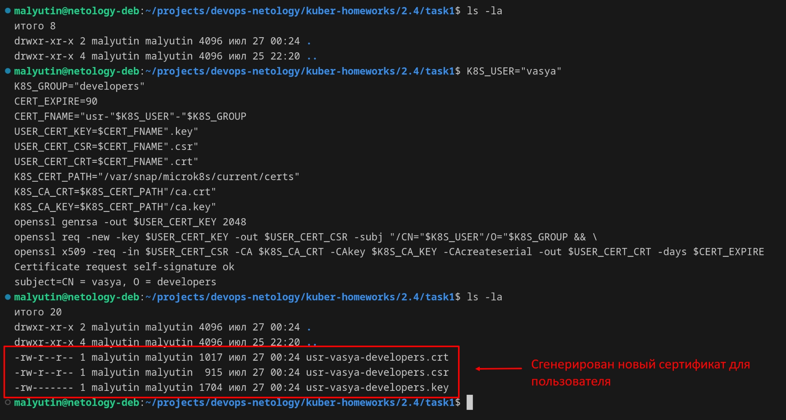
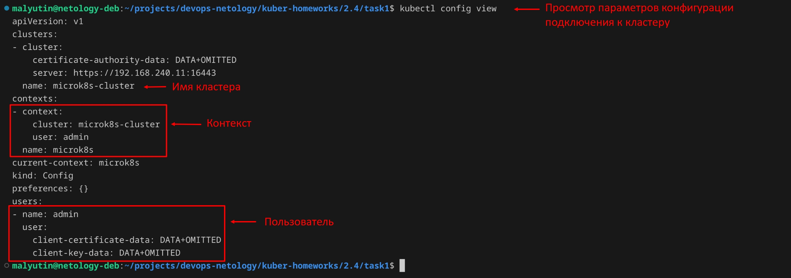
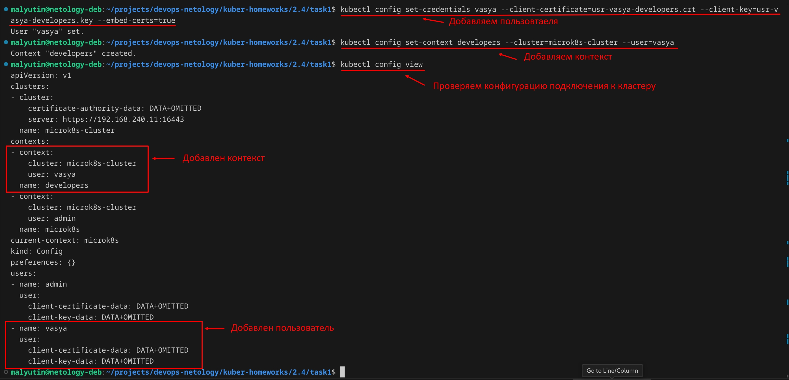
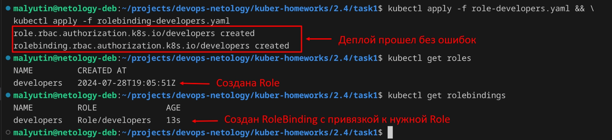
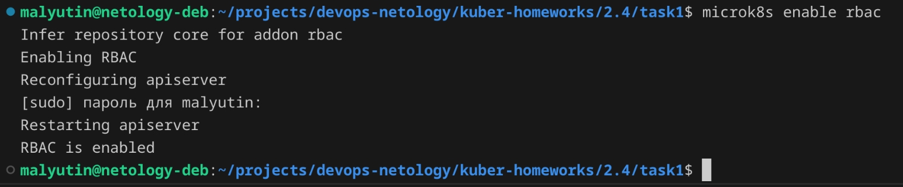
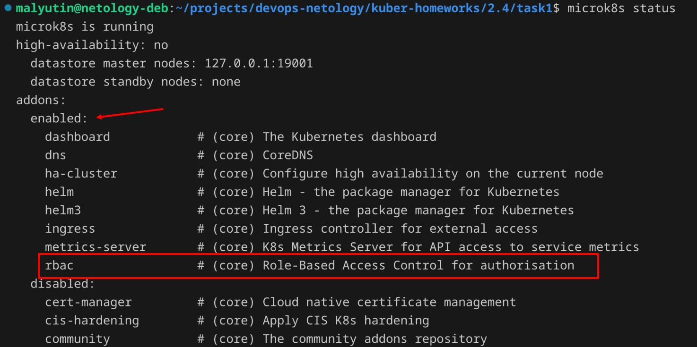
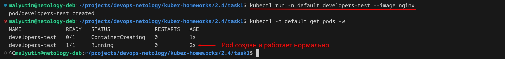
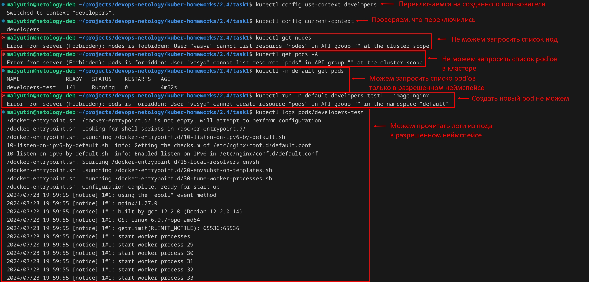
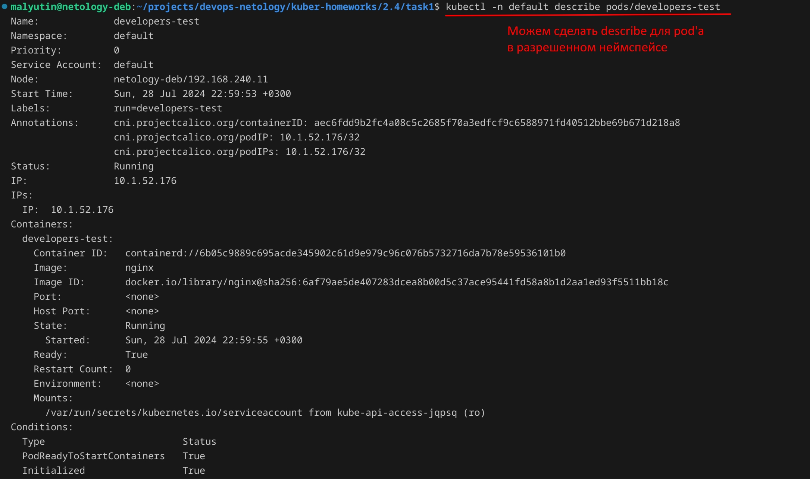

# Домашнее задание к занятию «Управление доступом»

## Цель задания

В тестовой среде Kubernetes нужно предоставить ограниченный доступ пользователю.

------

## Чеклист готовности к домашнему заданию

1. Установлено k8s-решение, например MicroK8S.
2. Установленный локальный kubectl.
3. Редактор YAML-файлов с подключённым github-репозиторием.


------

## Задание 1. Создайте конфигурацию для подключения пользователя

1. Создайте и подпишите SSL-сертификат для подключения к кластеру.

Создаем ключ для пользователя, запрос на выпуск сертификата, указывая в ключе `-subj` CN (пользователя) и O (группу) для использования в кластере, и создаем сертификат.

```bash
K8S_USER="vasya"
K8S_GROUP="developers"
CERT_EXPIRE=90
CERT_FNAME="usr-"$K8S_USER"-"$K8S_GROUP
USER_CERT_KEY=$CERT_FNAME".key"
USER_CERT_CSR=$CERT_FNAME".csr"
USER_CERT_CRT=$CERT_FNAME".crt"
K8S_CERT_PATH="/var/snap/microk8s/current/certs"
K8S_CA_CRT=$K8S_CERT_PATH"/ca.crt"
K8S_CA_KEY=$K8S_CERT_PATH"/ca.key"
openssl genrsa -out $USER_CERT_KEY 2048
openssl req -new -key $USER_CERT_KEY -out $USER_CERT_CSR -subj "/CN="$K8S_USER"/O="$K8S_GROUP && \
openssl x509 -req -in $USER_CERT_CSR -CA $K8S_CA_CRT -CAkey $K8S_CA_KEY -CAcreateserial -out $USER_CERT_CRT -days $CERT_EXPIRE
```



2. Настройте конфигурационный файл kubectl для подключения.

Уточняем, какое имя кластера, какие пользователи и контексты есть в используемом конфигурационном файле.



Добавил пользователя в конфигурационный файл kubectl для подключения, используя сгенерированный ключ и сертификат.

```bash
kubectl config set-credentials vasya --client-certificate=usr-vasya-developers.crt --client-key=usr-vasya-developers.key --embed-certs=true
```

Добавляем контекст и привязываем его к пользователю.

```bash
kubectl config set-context developers --cluster=microk8s-cluster --user=vasya
```

Проверяем, что в конфиграционный файл добавлены пользователь и контекст и есть привязка пользователя и контекста.



3. Создайте роли и все необходимые настройки для пользователя.

Определяю доступ пользователя с ограничением по неймспейсам (в данном случае для неймспейса `default`). Для этого использую `Role` и `RoleBinding`.
*Для пределения доступа пользователя на уровне кластера необходимо использовать `ClusterRole` и `ClusterRoleBinding`.*

4. Предусмотрите права пользователя. Пользователь может просматривать логи подов и их конфигурацию (`kubectl logs pod <pod_id>`, `kubectl describe pod <pod_id>`).

Создал Role [role-developers.yaml](./task1/role-developers.yaml) с правами просмотра логов подов и их конфигурацию (`kubectl logs pod <pod_id>`, `kubectl describe pod <pod_id>`).

```yaml
apiVersion: rbac.authorization.k8s.io/v1
kind: Role
metadata:
  name: developers
  namespace: default
rules:
- apiGroups: [""]
  resources: ["pods", "pods/log"]
  verbs: ["get", "watch", "list"]
```

Создал RoleBinding [rolebinding-developers.yaml](./task1/rolebinding-developers.yaml), в которой связал пользователя и роль.

```yaml
apiVersion: rbac.authorization.k8s.io/v1
kind: RoleBinding
metadata:
  name: developers
  namespace: default
subjects:
- kind: User
  name: vasya
  apiGroup: rbac.authorization.k8s.io
roleRef:
  kind: Role
  name: developers
  apiGroup: rbac.authorization.k8s.io
```

Деплоим манифесты в кластер

```bash
kubectl apply -f role-developers.yaml && \
kubectl apply -f rolebinding-developers.yaml
```

Проверяем, что Role и RoleBinding задеплоены и присутствуют в кластере с помощью команд

```bash
kubectl get roles
kubectl get rolebindings
```



У меня кластер на microk8s и в нем по-умолчанию отключен RBAC. Поэтому перед проверкой доступа для созданного пользователя включаем дополнение RBAC.

```bash
microk8s enable rbac
```



Проверяем, что RBAC активен.

```bash
microk8s status
```



Для проверки доступа созданного пользователя создадим в неймспейсе `default` простой деплоймент `developers-test`, состоящий из контейнера `nginx`.

```bash
kubectl run -n default developers-test --image nginx
```



Переключаемся на созданного пользователя (переключаем контекст) и проверяем его доступ к ресурсам кластера и назначенные права.

```bash
kubectl config use-context developers
```





Перед тем, как передать пользователю конфигурационный файл подключения к кластеру необходимо удалить из него данные (предварительно делаем копию конфигурационного файла, чтобы не потерять данные для подключения администратором кластера) о других пользователях и контекстах с помощью команд.

```bash
kubectl config delete-context <ИМЯ_КОНТЕКСТА>
kubectl config delete-user <ИМЯ_ПОЛЬЗОВАТЕЛЯ>
```

5. Предоставьте манифесты и скриншоты и/или вывод необходимых команд.

Манифесты и скриншоты представлены выше.

------
