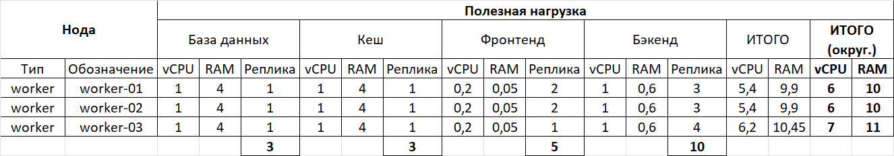
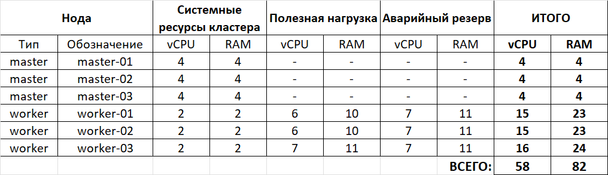
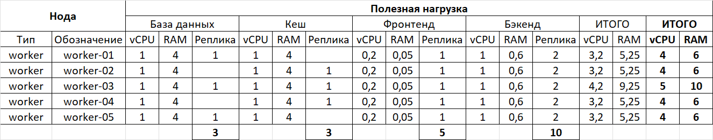
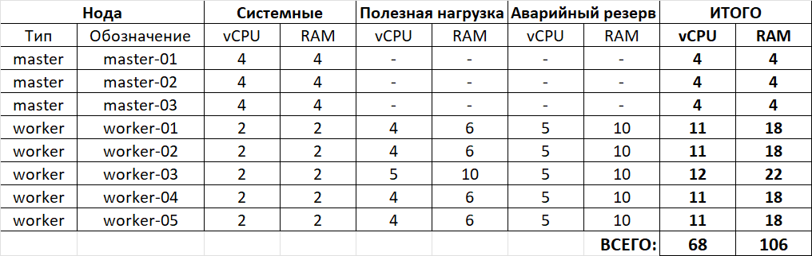
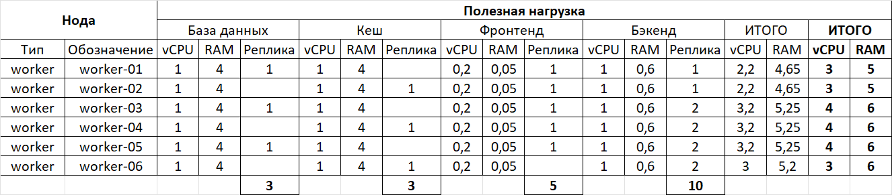
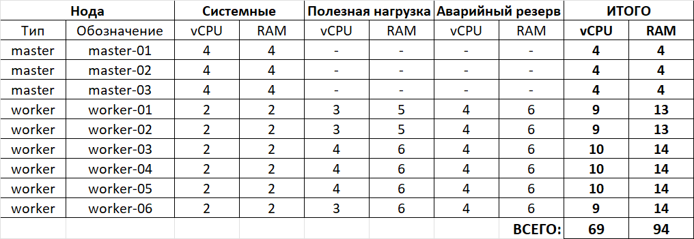
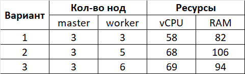

# Домашнее задание к занятию «Компоненты Kubernetes»

## Цель задания

Рассчитать требования к кластеру под проект

------

## Задание. Необходимо определить требуемые ресурсы

Известно, что проекту нужны база данных, система кеширования, а само приложение состоит из бекенда и фронтенда. Опишите, какие ресурсы нужны, если известно:

1. Необходимо упаковать приложение в чарт для деплоя в разные окружения.
2. База данных должна быть отказоустойчивой. Потребляет 4 ГБ ОЗУ в работе, 1 ядро. 3 копии.
3. Кеш должен быть отказоустойчивый. Потребляет 4 ГБ ОЗУ в работе, 1 ядро. 3 копии.
4. Фронтенд обрабатывает внешние запросы быстро, отдавая статику. Потребляет не более 50 МБ ОЗУ на каждый экземпляр, 0.2 ядра. 5 копий.
5. Бекенд потребляет 600 МБ ОЗУ и по 1 ядру на копию. 10 копий.

------

## Решение

### Соглашения

Исходя из постановки задачи и иных ограничений, установленных в разделе "**Правила приёма работы**" принимаем следующие соглашения:

1. Исходя из требования п.3 (Кеш должен быть отказоустойчивый) принимаем конфигурацию кластера Kubernetes, как HA. Поэтому в control-plane кластера должно быть не менее трех нод, а нод для размещения рабочей нагрузки - не менее двух.
2. Для системных нужд кластера для нод типа `master` принимаем следующие значения: CPU - 4 ядра, RAM - 4 Гб.
3. Для системных нужд кластера для нод типа `worker` принимаем следующие значения: CPU - 2 ядра, RAM - 2 Гб.
4. После развертывания кластера необходимо настроить мониторинг и собрать статистику по утилизации нод, на основании которой можно принять решение об изменении параметров кластера - увеличить количество CPU и/или RAM для нод, или изменить (увеличить) количество нод типа `worker`. Большее количество нод типа `worker` даст большую нагрзузку на системные компоненты кластера, такие, как `etcd` и `api-server` и повысит удельную стоимость полезной нагрузки за счет увеличившихся накладных расходов (ресурсов для системных нужд кластера).

### Варианты расчетов

Произведем расчеты для трех вариантов кластера, в каждом из которых будет количество нод типа `worker` пропорционально количеству типов нагрузки (pod'ов).

#### Вариант 1 - три ноды типа `worker` (пропорционально количеству pod'ов с БД и кэшем)

Распределим нагрузку по нодам типа `worker` и сведем все данные по полезной нагрузке в таблицу.

Максимальное потребление ресурсов полезной нагрузки, которое необходимо предусмотреть для аварийного запаса, который учитывает выход из строя как минимум одной ноды, составляет 7 vCPU и 11 RAM (здесь и далее подразумевается объем в Гб).

Итоговая конфигурация для нод типа `master` и `worker`

#### Вариант 2 - пять нод типа `worker` (пропорционально количеству pod'ов типа фронтенд и фекенд)

Распределим нагрузку по нодам типа `worker` и сведем все данные по полезной нагрузке в таблицу.

Максимальное потребление ресурсов полезной нагрузки, которое необходимо предусмотреть для аварийного запаса, который учитывает выход из строя как минимум одной ноды, составляет 5 vCPU и 10 RAM.

Итоговая конфигурация для нод типа `master` и `worker`

#### Вариант 3 - шесть нод типа `worker` (пропорционально количеству pod'ов с БД и кэшем - разнесем БД и кэш по разным нодам)

Распределим нагрузку по нодам типа `worker` и сведем все данные по полезной нагрузке в таблицу.

Максимальное потребление ресурсов полезной нагрузки, которое необходимо предусмотреть для аварийного запаса, который учитывает выход из строя как минимум одной ноды, составляет 4 vCPU и 6 RAM.

Итоговая конфигурация для нод типа `master` и `worker`

### Анализ полученных данных

Сведем все данные в одну таблицу для удобства

Приведенные выше расчеты вариантов организации кластера Kubernetes позволяют сделать (учитывая соглашения) следующие выводы:

 * Вариант 1 - самый оптимальный по стоимости и его можно рекомендовать для dev-окружения.
 * Вариант 2 - вероятно будет самым дорогим (зависит от провайдера ресурсов) и его врядли можно рекомендовать к использованию.
 * Вариант 3 - по стоимости, вероятно будет не дороже Варинта 2, но имеет на одну ноду больше (больше нод - больше возможностей повысить отказоустойчивость сервисов), что позволяет его рекомендовать к использованию для production-окружения.

**Примечания:**

1. При этом стоит отметить, что большее количество нод типа `worker` (Вариант 2 и Вариант 3) даст большую нагрзузку на системные компоненты кластера, такие, как `etcd` и `api-server`.
2. Для Варианта 2 и Варианта 3 необходимо помнить, что время создания реплики pod'ов, когда одна worker-нода выйдет из строя, может быть больше (не на всех worker-нодах есть образы всех контейнеров, используемых в проекте), чем для Варианта 1 (на каждой worker-ноде есть все образы контейнеров, используемых в проекте). Эту проблему можно решить кэшированием образов контейнеров всех типов, используемых в проекте, с применением дополнительных инструментов и утилит.

### Выводы

Таким образом для dev-окружения необходимы ноды в следующей конфигурации

Для production-окружения необходимы ноды в следующей конфигурации

